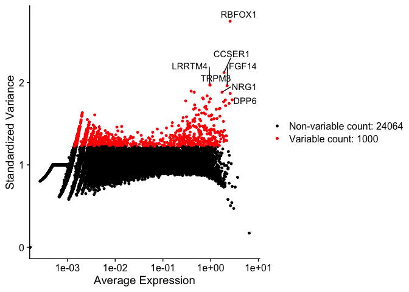

---
output:
  html_document:
    keep_md: yes
---


# 3. Feature selection


Because of the sparsity in the sequencing data many genes or features are almost not expressed.
Additionally, some genes are constantly expressed across cells. These features are then probably
not relevant to understand the difference between cells. On the other hand keeping these features can add noise and unnecessary complexity
to further analysis. Hence, we usually remove genes with very low variance and to select
only top highly variable genes (HVG).

We will use the function `FindVariableFeatures()` to calculate the top most variable genes.
The parameter nfeatures is used to set the number of top selected genes. We set to the top
1000 features.

``` r
ad_medula_filtered <- FindVariableFeatures(ad_medula_filtered, nfeatures = 1000)
```

This functions adds new data into the Seurat object!

We can access the top 1000 variable features using the VariableFeatures function. In the next
chunk we display the top first 6 (head) of this set. 


``` r
head(VariableFeatures(ad_medula_filtered))
```

```
## [1] "RBFOX1" "CCSER1" "LRRTM4" "TRPM3"  "FGF14"  "PDZRN4"
```


In the next scatter plot we can see the average expression *vs* the standardized variance for each feature.
Genes in red are the selected HVG.


``` r
# plot variable features with and without labels
plot1 <- VariableFeaturePlot(ad_medula_filtered)
plot1 <- LabelPoints(plot = plot1, 
                     points = head(VariableFeatures(ad_medula_filtered),
                                   10), 
                     repel = TRUE)
plot1 
```

<!-- -->


For further analysis we will use only HVGs. 

## Quiz


<details> 
<summary> Find the top 6 genes with the highest variance in descending order.
Normalize the gene expression values from the Seurat object. Calculate variances 
manually from the matrix. Sort genes based on variances in decreasing order and 
show top 6 genes.
<br>
a) RBFOX1, CCSER1, XIST, NRG1, CACNA2D3, FGF14
<br>
b) PCDH9, NRXN1, IL1RAPL1, CTNNA3, RBFOX1, NKAIN2
<br>
c) HLA-DRA, LYZ, NKG7, S100A9, TYROBP, CST3 
</summary>
<br>
<b>Answer:</b>
<br>

<code>
ad_medula_filtered<- NormalizeData(ad_medula_filtered) %>% ScaleData()
<br>
norm.exp <- GetAssayData(ad_medula_filtered, slot = 'data')
</code>

<b>Calculation of the variance in genes</b>
<br>
<code>std.devs <- apply(norm.exp, 1, var)</code>

<b>Showing the top 6 genes with highest variance</b>
<br>
<code>head(sort(std.devs, decreasing = T))</code>

</details>

<br> 

[Previous Chapter (Quality control)](./02-Quality_control.md)|
[Next Chapter (Normalization & Dim. reduction)](./04-Normalization_and_Dimensional_Reduction.md)
