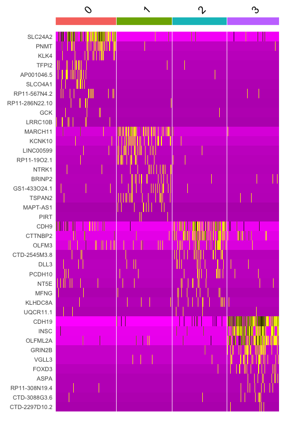
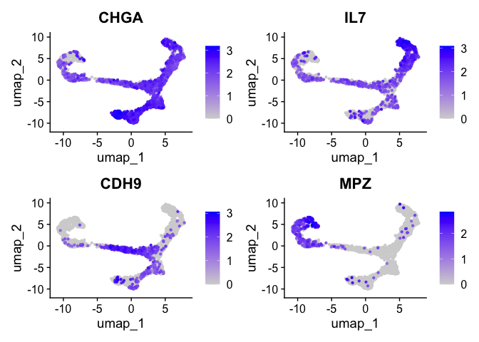
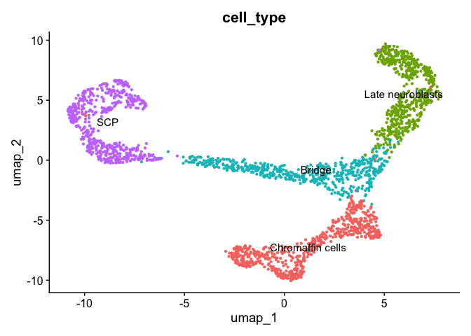
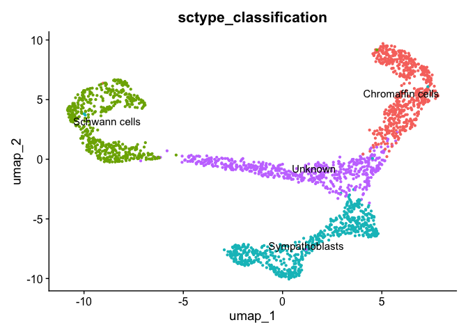

---
output:
  html_document:
    keep_md: yes
---


# 7. Profiling cells

In the context of single-cell RNA-seq (scRNA-seq), cell profiling refers to the process of characterizing individual cells based on their gene expression patterns to understand their identity, functional state, and potential biological roles.

Briefly, cell profiling aims to answer questions such as:

* What cell types are present in the sample?
For example, neurons, T cells, macrophages, or epithelial cells.
What is the state of each cell?

* Cells of the same type may differ in activation status, cell cycle phase, differentiation stage, or response to stimuli such as infection or treatment.
How heterogeneous is the population?
Cell profiling reveals subpopulations that would be masked in bulk RNA-seq experiments.

## Markers visualization

First, we will take top 10 ranked genes based in Log FC and visualize their
expression in clusters using a heatmap representation.


``` r
top10 <- ad_medula.degs %>% 
             group_by(cluster) %>% 
             top_n(n = 10, wt = avg_log2FC)
DoHeatmap(ad_medula_filtered, 
          features = top10$gene) + NoLegend()
```

<!-- -->


We can visualize additional known canonical markers as used in Janski S et al, 2021 
in order to assign cell categories. 


``` r
canonical_markers <- c(
  "PLP1",
  "MPZ",
  "SOX10",
  "CDX19",
  "ERBB3",
  "ERBB4",
  "CDH9",
  "CTTNBP2",
  "ASCL1",
  "DBH",
  "TH",
  "CHGA",
  "DDC",
  "PNMT",
  "TOP2A",
  "NEFM",
  "GAP43",
  "SMTN2",
  "ISL1",
  "ALK",
  "SYN3",
  "IL7"
)
```


## Visualization of gene expression levels of markers in clusters

Because of the signal dropout it's hard to say what is the proportion of cells that are actually
expressing a marker. Dotplots are commonly used to visualize both gene expression levels alongside 
with the frequency of cells expressing the marker. The `DotPlot()` function comes at handy.


``` r
DotPlot(ad_medula_filtered, 
            features = canonical_markers) +
      coord_flip()
```

<!-- -->

## UMAP visualization

The markers can also be visualized in UMAPs. UMAPs are useful for visualizing possible heterogeneity
in gene expression which could reveal possible subclusters of cells with
particular phenotypes.


``` r
FeaturePlot(ad_medula_filtered, 
            features = c("CHGA",
                         "IL7",
                         "CDH9", 
                         "MPZ"), 
            order = TRUE)
```

<!-- -->


For example, MPZ is expressed very specifically in the left branch
but some heterogeneity can be observed.


## Cell type labelling


The genes CHGA, DBH and TH are markers of Chromaffin cells while IL7 and
SYN3 are expressed in Late Neuroblasts. CDH9 and CTTNBP2 are mostly 
expressed in Bridge cells and ERBBP3 and ERBBP4 are present in SCPs cells.

Now, we will annotate the cells with their identified identities in the seurat 
object. We will map the cluster names as follows:

**Beware: your UMAP might look slightly different! So please adapt the cluster<>cell type mapping according to your results! For example, you might have more/less clusters!**


``` r
mapping <- data.frame(seurat_cluster=c('0', 
                                       '1', 
                                       '2',
                                       '3'),
                      cell_type=c('Chromaffin cells', 
                                  'Late neuroblasts', 
                                  'Bridge',
                                  'SCP'))
mapping
```

```
##   seurat_cluster        cell_type
## 1              0 Chromaffin cells
## 2              1 Late neuroblasts
## 3              2           Bridge
## 4              3              SCP
```

To assign the new labels we can use the map function from the plyr R package
as follows:


``` r
ad_medula_filtered$'cell_type' <- plyr::mapvalues(
  x = ad_medula_filtered$seurat_clusters,
  from = mapping$seurat_cluster,
  to = mapping$cell_type
)
```


Now, we can plot the clusters with the assigned cell types.


``` r
DimPlot(ad_medula_filtered, 
        group.by = 'cell_type',   ## set the column to use as category
        label = TRUE, reduction = 'umap')  +          ## label clusters
        NoLegend()                ## remove legends
```

<!-- -->


## Cell profiling automation

There are several tools for the automation of cell type identification, for example,
sctype, singleR, CellAssign, etc. In general, they use a reference in the form of a previously 
curated dataset and transfer information to a query dataset. Here, we will quickly
exemplified the sctype R library. 


``` r
invisible({
  library(openxlsx)
  library(HGNChelper)
})

source("https://raw.githubusercontent.com/IanevskiAleksandr/sc-type/master/R/sctype_wrapper.R") 

ad_medula_filtered <- FindClusters(ad_medula_filtered, 
                            resolution = 1, 
                            verbose = FALSE)

sample <- run_sctype(ad_medula_filtered, 
                     assay = "RNA", 
                     scaled = TRUE, 
                     known_tissue_type="Adrenal",
                     custom_marker_file="https://raw.githubusercontent.com/IanevskiAleksandr/sc-type/master/ScTypeDB_full.xlsx", 
                     name="sctype_classification")
```

```
## [1] "Using Seurat v5 object"
## [1] "New metadata added:  sctype_classification"
```


Let's inspect again the metadata.


``` r
head(sample@meta.data)
```

```
##                          orig.ident nCount_RNA nFeature_RNA percent.mt
## AAACGCTGTCAAAGTA_1 human_ad_medulla   2673.072         1347 0.22453995
## AAAGGATCAGATCACT_1 human_ad_medulla   2563.070         1226 0.07635909
## AAAGGATCAGCAGAAC_1 human_ad_medulla   2593.677         1254 0.00000000
## AACAACCAGTCCTACA_1 human_ad_medulla   3183.051         1871 0.14112372
## AACAAGAAGGACTTCT_1 human_ad_medulla   2718.732         1391 0.06546350
## AACAAGATCTGCGTCT_1 human_ad_medulla   3705.433         2811 0.08209384
##                    RNA_snn_res.0.1 seurat_clusters        cell_type
## AAACGCTGTCAAAGTA_1               1               0 Late neuroblasts
## AAAGGATCAGATCACT_1               1               0 Late neuroblasts
## AAAGGATCAGCAGAAC_1               2               1           Bridge
## AACAACCAGTCCTACA_1               2               1           Bridge
## AACAAGAAGGACTTCT_1               2               1           Bridge
## AACAAGATCTGCGTCT_1               3               4              SCP
##                    RNA_snn_res.1 sctype_classification
## AAACGCTGTCAAAGTA_1             0      Chromaffin cells
## AAAGGATCAGATCACT_1             0      Chromaffin cells
## AAAGGATCAGCAGAAC_1             1               Unknown
## AACAACCAGTCCTACA_1             1               Unknown
## AACAAGAAGGACTTCT_1             1               Unknown
## AACAAGATCTGCGTCT_1             4         Schwann cells
```


Now we see a new column called `sctype_classification` which contains the labels 
annotated to each cell type. Let's plot now this annotations in a UMAP.


``` r
DimPlot(sample, 
        group.by = 'sctype_classification', 
        label = TRUE) + NoLegend()
```

<!-- -->


Does it look similar to our previous conclusions? Cell assignation depends
on the definition of cell type signatures, which corresponds to a list
of cell type markers. The library scType depends on [this](https://raw.githubusercontent.com/IanevskiAleksandr/sc-type/master/ScTypeDB_full.xlsx) list of
defined signatures. Please, download and inspect the database of signatures.
Are there all human cell types represented in this list?

## Quiz

> Compare your cell profiling to the ground truth from the publication.
Load the cell annotations as follows:

```
cells <- read.delim(
  "https://raw.githubusercontent.com/caramirezal/caramirezal.github.io/master/courses/data/cells_subset_2400_cells.tsv",
  header = TRUE,
  stringsAsFactors = FALSE
)
```

Then, compare the cells annotations stored in the the data frame with the
annotations from the processed seurat object.


[Previous Chapter (Differential expression)](./06-Differential_Expression.md)|
[Next Chapter (Pseudotime analysis)](./08-Pseudotime_analysis.md)

