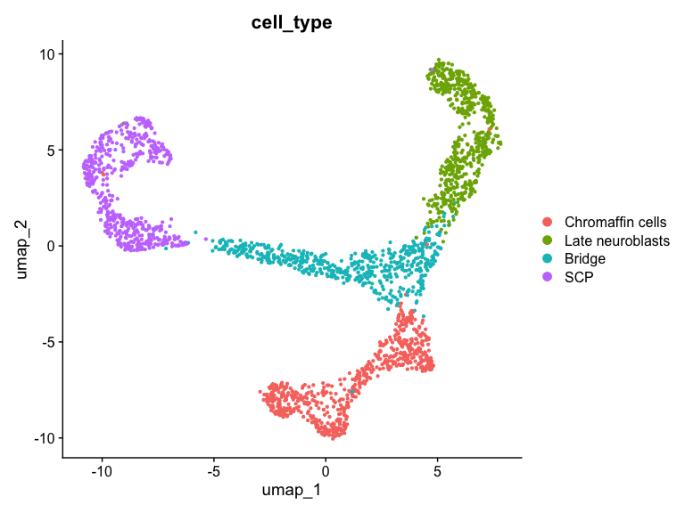
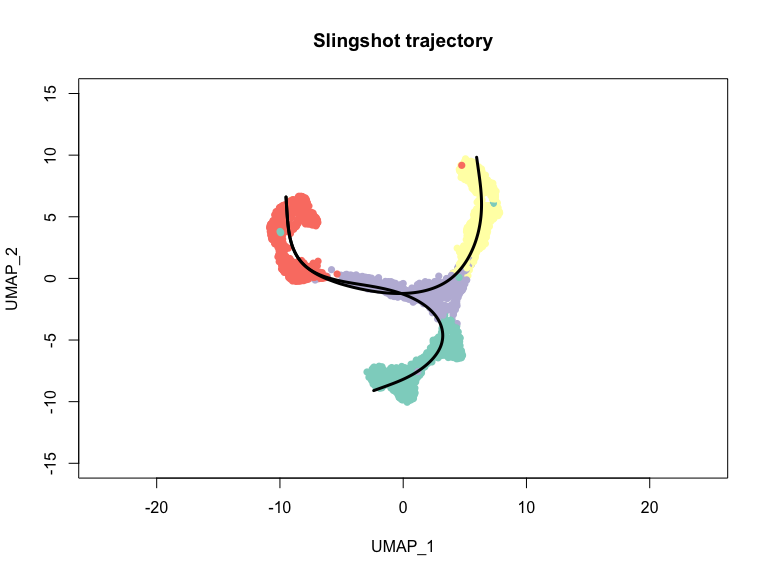
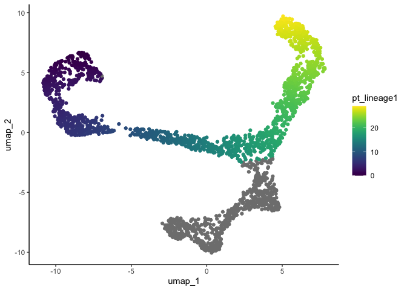
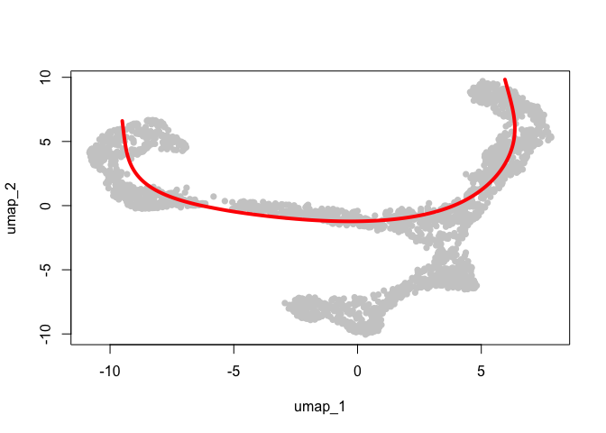
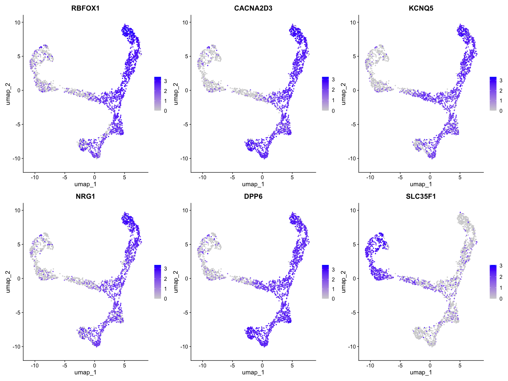

---
output:
  html_document:
    keep_md: yes
---


# 8. Introduction

From the gene expression profile, we can determine a *pseudotime* for each cell, which represents it developmental state along a developmental trajectory from progenitor cells to differentiated cells. Each cell is assigned a pseudotime, and cells can then be ordered along this time axis.

There are many computational approaches for pseudotime inference. Here, trajectory inference is performed using **Slingshot**. Existing UMAP coordinates
provided by the original study are used directly. No cell filtering or
subsetting is performed.

Slingshot is a trajectory inference method that reconstructs developmental paths from single-cell RNA sequencing data. It starts by representing cells in a low-dimensional space, such as UMAP or PCA, where cells with similar gene expression profiles are located close together. Slingshot then connects groups of cells (clusters or annotated cell types) using a minimum spanning tree, which provides a framework for identifying possible developmental relationships. Next, it fits smooth curves through the cells to represent one or more biological trajectories. Finally, each cell is assigned a pseudotime value, which reflects its relative position along a trajectory. Pseudotime does not correspond to real chronological time, but rather to a cell's progression through a biological process such as differentiation, allowing researchers to study how gene expression changes as cells transition between states.

The starting population is defined as Schwann Cell Precursors (SCPs).

We start by loading the required libraries

# Load libraries


``` r
library(SingleCellExperiment)
library(slingshot)
library(Matrix)
library(ggplot2)
library(RColorBrewer)
library(dplyr)
library(patchwork)

set.seed(1234)
```


# Inspect metadata

We will implement a pseudotime analysis along the already annotated cell types. The calculation
is guided on cluster or cell type information. 


``` r
str(seurat_obj@meta.data)
```

```
## 'data.frame':	2287 obs. of  7 variables:
##  $ orig.ident     : Factor w/ 1 level "human_ad_medulla": 1 1 1 1 1 1 1 1 1 1 ...
##  $ nCount_RNA     : num  2673 2563 2594 3183 2719 ...
##  $ nFeature_RNA   : int  1347 1226 1254 1871 1391 2811 1899 2200 1192 2690 ...
##  $ percent.mt     : num  0.2245 0.0764 0 0.1411 0.0655 ...
##  $ RNA_snn_res.0.1: Factor w/ 4 levels "0","1","2","3": 2 2 3 3 3 4 2 4 3 3 ...
##  $ seurat_clusters: Factor w/ 4 levels "0","1","2","3": 2 2 3 3 3 4 2 4 3 3 ...
##  $ cell_type      : Factor w/ 4 levels "Chromaffin cells",..: 2 2 3 3 3 4 2 4 3 3 ...
```


# Data normalization

Slingshot does not directly require normalized expression values when
operating on existing embeddings, but normalization is useful for
downstream analyses.


# Create SingleCellExperiment object

Slingshot uses a different object also used for scRNA-Seq analysis 
from the SingleCellExperiment library.


``` r
sce <- as.SingleCellExperiment(seurat_obj)

sce
```

```
## class: SingleCellExperiment 
## dim: 25064 2287 
## metadata(0):
## assays(3): counts logcounts scaledata
## rownames(25064): RP11-34P13.7 AL627309.1 ... LINGO4 RP11-612A1.1
## rowData names(0):
## colnames(2287): AAACGCTGTCAAAGTA_1 AAAGGATCAGATCACT_1 ...
##   TTCCGGTTCGGTAGGA_17 TTGTTGTCAGAAATCA_17
## colData names(8): orig.ident nCount_RNA ... cell_type ident
## reducedDimNames(2): PCA UMAP
## mainExpName: RNA
## altExpNames(0):
```

As in seurat, the SingleCellExperiment object contains the gene expression
data along with metadata. We will use this object to calculate the trajectories
based in already calculated UMAP coordinates.

# Add existing UMAP coordinates

The dataset already contains UMAP coordinates in the metadata.


``` r
umap_coords <- as.matrix(
  Embeddings(seurat_obj, "umap")
)

reducedDims(sce)$UMAP <- umap_coords
```

# Visualize annotated cell types


``` r
DimPlot(seurat_obj, group.by = 'cell_type') 
```

<!-- -->

# Run Slingshot

The slingshot() function performs trajectory inference using the cell annotations and low-dimensional representation of the data. In this example, Slingshot uses the celltype labels to define groups of biologically similar cells and the existing UMAP coordinates (reducedDim = "UMAP") to determine how these groups are arranged in the developmental landscape. The argument start.clus = "SCPs" specifies Schwann Cell Precursors (SCPs) as the starting population, allowing Slingshot to infer trajectories that originate from this early cell state and progress toward more differentiated cell types. The resulting object contains the inferred lineages as well as pseudotime values for each cell.


``` r
sce <- slingshot(
  sce,
  clusterLabels = "cell_type",  # use annotated cell types as groups
  reducedDim = "UMAP",         # use existing UMAP coordinates
  start.clus = "SCP"          # define SCPs as the starting population
)
```

# Visualize inferred trajectories


``` r
celltype_factor <- as.factor(colData(sce)$cell_type)

plot(
  reducedDims(sce)$UMAP,
  col = brewer.pal(
    min(length(levels(celltype_factor)), 12),
    "Set3"
  )[as.numeric(celltype_factor)],
  pch = 16,
  asp = 1,
  xlab = "UMAP_1",
  ylab = "UMAP_2",
  main = "Slingshot trajectory",
  xlim = c(-15, 15),
  ylim = c(-15, 15)
)

lines(
  SlingshotDataSet(sce),
  lwd = 3,
  col = "black",
  xlim = c(-15, 15),
)
```

<!-- -->

## Inspecting and subsetting trajectories


``` r
slingLineages(sce)
```

```
## $Lineage1
## [1] "SCP"              "Bridge"           "Late neuroblasts"
## 
## $Lineage2
## [1] "SCP"              "Bridge"           "Chromaffin cells"
```

## Extracting pseudotime 

seudotime <- slingPseudotime(sce) extracts the inferred developmental ordering of each cell from a Slingshot trajectory, assigning a numeric value that reflects where each cell sits along a lineage path from early to late states.


``` r
pseudotime_df <- slingPseudotime(sce) %>% as.data.frame()

seurat_obj$pt_lineage1 <- pseudotime_df$Lineage1
```

The NA points in pt_lineage1 are cells for which Slingshot (or whatever generated pseudotime) did not assign a pseudotime value for that specific lineage.

In practice, that usually means one of two things:

the cell is not part of the inferred trajectory/lineage 2 (it belongs to another branch), or
the algorithm couldn’t place it along that lineage because it lies outside the fitted path or isn’t connected to it.


``` r
## Extracting UMAP coordinates
umap_coords <- Embeddings(seurat_obj, "umap") %>%
                  as.data.frame()

## Extracting pseudotime coordinates
pseudotime_df <- seurat_obj@meta.data

## Checkin cells order
all(rownames(umap_coords) == rownames(pseudotime_df))
```

```
## [1] TRUE
```

``` r
## Merging datafarmes
pseudotime_df <- cbind(umap_coords, pseudotime_df)

pseudotime_df %>%
    ggplot(aes(umap_1, umap_2, colour = pt_lineage1)) +
      geom_point() +
      viridis::scale_color_viridis() +
      theme_classic()
```

<!-- -->

We can visualize the smooth fitted trajectory as follows.


``` r
plot(
  reducedDims(sce)$UMAP,
  col = "grey80",
  pch = 16
)

lines(
    slingCurves(sce)[["Lineage1"]],
    lwd = 4,
    col = "red"
)
```

<!-- -->


Identify genes associated with pseudotime

We next identify genes whose expression changes continuously along the inferred developmental trajectory. To do this, we calculate the Spearman correlation between gene expression and pseudotime values. Spearman correlation is a rank-based measure that is robust to non-linear relationships and is therefore commonly used in pseudotime analyses.

Only cells with assigned pseudotime values are included in the analysis.


``` r
# Extract normalized expression values
expr_mat <- GetAssayData(
  seurat_obj,
  assay = "RNA",
  slot = "data"
)

# Keep only cells with pseudotime values
valid_cells <- !is.na(seurat_obj$pt_lineage1)

expr_mat <- expr_mat[, valid_cells]

pseudotime <- seurat_obj$pt_lineage1[valid_cells]
```


``` r
gene_correlations <- apply(
  expr_mat,
  1,
  function(x) {
    cor(
      x,
      pseudotime,
      method = "spearman"
    )
  }
)

correlation_df <- data.frame(
  gene = names(gene_correlations),
  correlation = gene_correlations
)

correlation_df <- correlation_df %>%
  arrange(desc(abs(correlation)))

head(correlation_df)
```

```
##              gene correlation
## RBFOX1     RBFOX1   0.8385368
## CACNA2D3 CACNA2D3   0.8076741
## KCNQ5       KCNQ5   0.7817430
## NRG1         NRG1   0.7757867
## DPP6         DPP6   0.7476792
## SLC35F1   SLC35F1  -0.7367129
```


The genes with the largest absolute correlation coefficients exhibit the strongest monotonic changes along pseudotime.

## Visualize the top correlated genes

We will visualize the six genes with the strongest associations with pseudotime on the UMAP embedding.


``` r
top_genes <- correlation_df$gene[1:6]

FeaturePlot(
  seurat_obj,
  features = top_genes,
  reduction = "umap",
  ncol = 3,
  pt.size = 0.5
)
```

<!-- -->

These visualizations reveal where pseudotime-associated genes are expressed within the developmental landscape. Genes positively correlated with pseudotime tend to be enriched in later cellular states, whereas negatively correlated genes are often associated with earlier stages of the trajectory.


[Previous Chapter (Profiling cells)](./07-Profiling_cells.md)|
