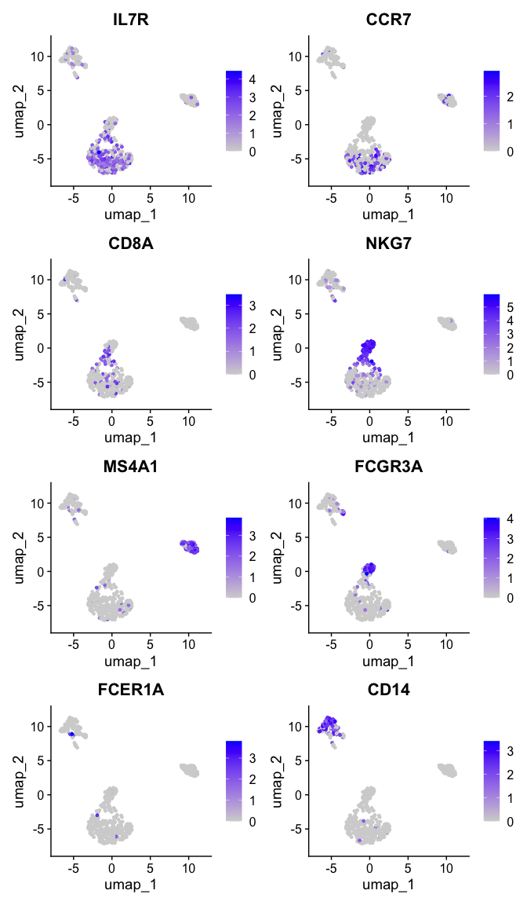
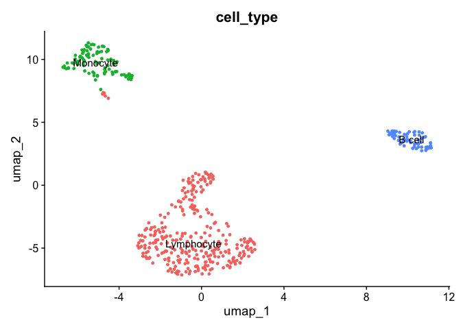
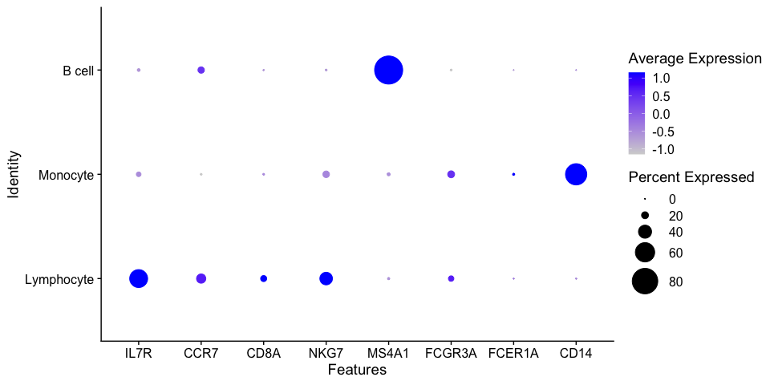

---
output:
  html_document:
    keep_md: yes
---


# 1. Standard Preprocessing using Seurat


Some standard steps are usually carried out in scRNA-Seq prior to further analysis as QC, dimensional
reduction and marker visualization. Here, we will use the Seurat R package to perform these steps which
is increasingly becoming the most popular tool, however, there are some other options as SingleCellExperiment
in R and scanpy available for python. First, we need to define a Seurat object.

```{r}
library(Seurat)
```


Loading datasets

```{r}
pbmc_url  <- 'https://github.com/caramirezal/caramirezal.github.io/raw/master/bookdown-minimal/data/pbmc_10X_500_cells.mtx.rds'
pbmc.mtx <- readRDS(url(pbmc_url))
```


```{r}
dim(pbmc.mtx)
```

```{r}
pbmc.mtx[1:5,1:5]
```
```{r}
umi.sum = apply(pbmc.mtx,2,sum)
```

```{r}
umi.sum.genes = apply(pbmc.mtx,1,sum)
```

```{r}
sum(pbmc.mtx==0)/prod(dim(pbmc.mtx))*100
```


## Creating Seurat object

We create a Seurat object using the `CreateSeuratObject` function as follows. Use the `?function` helper
in R to get information about the parameters that are need to be provided to the function.

 * counts - a count matrix. It can be a matrix, sparse matrix or dataframe.
 * project - A single character string. Correspond to a arbitrary name to label the object.
 * assay - A single character string. An arbitrary name that usually is assigned to label the
            type of sequencing information, for example, RNA, spliced RNA, ATAC, etc...
 * min.cells - An integer. Indicates a threshold of the number of cells for which a feature was
              recorded. Cells below that threshold will be filtered out.
 * min.features - An integer. Similar to min cells but for the number of features of a cell.
 


```{r}
library(Seurat)

pbmc.seurat <- CreateSeuratObject(
  counts = pbmc.mtx, 
  project = 'PBMC', 
  assay = 'RNA', 
  min.cells = 1, 
  min.features = 1
)
```

The variable `pbmc.seurat` now contains the Seurat object that we can feed into the package.
If we print the variable we get information about the number of genes and cells.


```{r}
pbmc.seurat
```

```
## An object of class Seurat 
## 12673 features across 500 samples within 1 assay 
## Active assay: RNA (12673 features, 0 variable features)
```

## Exploring the Seurat object


Seurat objects can be seen as a container of different features. At this step it contains
our gene expression matrix, but in addition it can store metadata, processed data,
information from different assays, for example, scATACSeq, scCITESeq or unspliced transcripts.

We can explore the seurat object using the `$` to explore its *metadata* in combination with the tab 
key. For example, during the creation of the seurat object the number of counts quality metric
is calculated and added to the metadata. We can explore this metric by accessing the metadata
as follows.


```{r}
library(tidyverse)
pbmc.seurat$nCount_RNA %>% head
```

```
## AAAGAGACGGACTT-1 AAAGATCTGGGCAA-1 AAAGCAGATATCGG-1 AAAGTTTGATCACG-1 
##             1151             1347             4584             1268 
## AAATCAACCCTATT-1 AAATGTTGTGGCAT-1 
##             5676             2761
```

 We can do the same with the `@` operator to explore the different *slots*. For example,
 we can extract the original count matrix that we used to create the seurat object as follows:
 
 

```{r}
pbmc.seurat@assays$RNA$counts[1:5, 1:5]
```

```
## 5 x 5 sparse Matrix of class "dgCMatrix"
##            AAAGAGACGGACTT-1 AAAGATCTGGGCAA-1 AAAGCAGATATCGG-1 AAAGTTTGATCACG-1
## AL627309.1                .                .                .                .
## AP006222.2                .                .                .                .
## LINC00115                 .                .                .                .
## NOC2L                     .                .                .                .
## PLEKHN1                   .                .                .                .
##            AAATCAACCCTATT-1
## AL627309.1                .
## AP006222.2                .
## LINC00115                 .
## NOC2L                     .
## PLEKHN1                   .
```


## Extracting expression values 


Next, we visualize gene counts to see its behavior. We take a look at the expression of the 
house keeping gene ACTIN Beta and plot an histogram of count values. We will use the
the function `FetchData` which is used to extract values from selected features in the Seurat
object and then plot it using an histogram.


```{r}
actin <- FetchData(pbmc.seurat, vars = 'ACTB')
hist(actin$ACTB)
```

# 2. Quality control

# Quality control


Filtering cells with low sequencing quality is a very important step since it can greatly
impact in further analysis. Quality check and control often requires to visualize and inspect
samples in order to determine appropiate thresholds. Threshold values might vary from one 
dataset to another, so no hard threshold rule can be applied equally to every case.

We will examine the number of UMI counts, the number of RNA features and the percentage of reads 
of mitochondrial genes.

We will first calculate the percentage of UMI counts of reads mapped to mitochondrial genes. This
step most be manually done since is based on a *priori knowledge* of which genes corresponds to
mitochondrial genes. 
In this case, genes are annotated using human ensembl gene symbol annotations mitochondrial 
genes are annotated starting with a `MT-` string.


```{r}
pbmc.seurat[["percent.mt"]] <- PercentageFeatureSet(pbmc.seurat, pattern = "^MT-")
```

Then, we can visualize the following metrics.

 * Number of features - Correspond to the number of different mapped genomic features. For example, in the
 case of scRNA-Seq features corresponds to genes, in ATAC-Seq to genomic ranges, etc. High number of features
 can indicate doublets and empty cells. Usually between 1 and 30000.
 
 * Number of counts - Number of mapped reads. It can also indicate the presence of doublets and empty 
droplet. It's generally correlated to the number of features. Usually between 1 and 20000.
 
 * Percentage of mitochondrial genes - Percentage of mapped reads that are annotated to mitochondrial
 genes. The presence of high levels of % of mitochondrial genes can suggest that a cell have lost
 its membrane integrity or that the cytoplasm has been leaked off and only the mitochondria was retained.
Usually a range from 0 to 10 is aceptable.


We can plot these metrics using the function `VlnPlot()` as follows:


```{r}
VlnPlot(pbmc.seurat, features = c('nFeature_RNA', 'nCount_RNA', 'percent.mt'))
```

The violin plots show the values of the metrics for each cell along with an adjusted violin 
distribution.

## Filtering out cells

Based on the previous violin plots we can define some thresholds and filter out cells using
the `subset` function. In the following code we select cells having nFeatures < 1250, 
nCount < 4000 and percentage of reads mapped to mitochondrial genes < 5 percent.


```{r}
pbmc.filtered <- subset(pbmc.seurat, 
                           nFeature_RNA < 1250 &
                                nCount_RNA < 4000 & 
                                    percent.mt < 5)
```

We can check the number of cell that passed the QC.


```{r}
ncol(pbmc.filtered)
```

```
## [1] 452
```


## Normalization

There are several methods for normalization of scRNA-Seq data. A commonly
used strategy is the log normalization which basically corrects sequencing
deep in cells by dividing each feature by the total number of counts and
then multiplied the result by a factor, usually 10000, and finally the
values are log transformed.

Log normalization can be implemented by using the `NormalizeData()` function.


```{r}
pbmc.filtered <- NormalizeData(pbmc.filtered)
```

Then, in order to make genes measurements more comparable log transformed
values are scaled in a way that the media is equal to zero and the variance
is equal to 1 as follows:


```{r}
pbmc.filtered <- ScaleData(pbmc.filtered)
```


## Quizzes


**QUIZ 1**

<details>
<summary> How are the number of features and UMI counts related?
<br>
a) They are not related and randomly distributed in a scatter plot
<br>
b) They are related in a non-linear way
<br>
c) They are linearly related
<br>
TIP: Use the function FeatureScatter, inspect the manual using ?function.
</summary>
<br>
<b>Answer:</b>
<br>
<code>FeatureScatter(pbmc, feature1 = "nCount_RNA", feature2 = "nFeature_RNA")</code>

We observe as expected a linear relation between the number of UMI counts and the 
features recorded.

</details> 


**QUIZ 2**


Repeat the analysis for the content in mitochondrial reads on the `pbmc200.seurat` object you created in the previous section. 


<details>
<summary>
What is the mean and median values of the percentage of mitochondrial reads?

1. mean=2.2133 and median=2.0532
2. mean=2.2246 and median=2.0639
3. mean=0.0102. and median=1.1743
</summary>

<code>pbmc_v2.seurat[["percent.mt"]] <- PercentageFeatureSet(pbmc_v2.seurat, pattern = "^MT-")</code>
<code>summary(pbmc_v2.seurat@meta.data$percent.mt)</code>

<code>
   Min. 1st Qu.  Median    Mean 3rd Qu.    Max. </code>
<code> 0.1667  1.4922  2.0639  2.2246  2.7384 10.4478 
 </code>

</details>

**Apply the same filtering rules on the `pbmc200.seurat` object!**


# 3. Feature selection


Because of the sparsity in the sequencing data many genes or features are almost no expressed.
Additionally, some genes are constantly expressed across cells. These features are then probably
not playing any function in cells and on the other hand can just add noise and unnecessary complexity
to further analysis. Then, it's usual to remove genes with very low variability and to select
only top highly variable genes (HVG).

We will use the function `FindVariableFeatures()` to calculate the top most variable genes.
The parameter nfeatures is used to set the number of top selected genes. We set to the top
1000 features.


```{r}
pbmc.filtered <- FindVariableFeatures(pbmc.filtered, nfeatures = 1000)
```


We can access to the top 1000 variable features using the VariableFeatures function. In the next
chunk we display the top first 6 (head) of this set. 


```{r}
head(VariableFeatures(pbmc.filtered))
```

```
## [1] "S100A9" "LYZ"    "S100A8" "FTL"    "GNLY"   "FTH1"
```


In the next scatter plot we can see the average expression *vs* the standardized variance for each feature.
Genes in red are the selected HVG.


```{r}
# plot variable features with and without labels
plot1 <- VariableFeaturePlot(pbmc.filtered)
plot1 <- LabelPoints(plot = plot1, 
                     points = head(VariableFeatures(pbmc.filtered),
                                   10), 
                     repel = TRUE)
plot1 
```


For further analysis we will use only HVGs. 

## Quiz

Repeat this analysis using the `pbmc200.seurat` object. 

<details> 
Normalize the gene expression values from the Seurat object.
Calculate variances manually from the matrix. Sort genes based on variances in 
decreasing order and show top 6 genes.
<summary> Find the top 6 genes with the highest variance in descending order
<br>
a) HLA-DRA, CST3, S100A8, NKG7, S100A9, LYZ
<br>
b) NKG7, S100A8, S100A9, LYZ, CST3, HLA-DRA
<br>
c) HLA-DRA, LYZ, NKG7, S100A9, TYROBP, CST3 
</summary>
<br>
<b>Answer:</b>
<br>

<code>
pbmc200.seurat<- NormalizeData(pbmc200.seurat) %>%
                      ScaleData()
norm.exp <- GetAssayData(pbmc200.seurat, slot = 'data')
</code>

<b>Calculation of the variance in genes</b>
<code>std.devs <- apply(norm.exp, 1, var)</code>

<b>Showing the top 6 genes with highest variance</b>
<code>head(sort(std.devs, decreasing = T))</code>

</details>

# 4. Dimensional Reduction

The size of scRNA-Seq matrices can be huge and for this reason techniques to reduce the dimensionality
of this data are used. Here, we will use PCA, a very common techniques for dimension
reduction and visualization.

We will run a PCA using the already calculated top 1000 HVGs using the function `RunPCA()`.


```{r}
pbmc.filtered <- RunPCA(pbmc.filtered, 
                        features = VariableFeatures(pbmc.filtered))
```

We can assess the dimensionality, a measure of the complexity, by using an
elbow plot of the standard deviation for each principal component (PC)
from the PCA.

We will use the function `ElbowPlot()`.


```{r}
ElbowPlot(pbmc.filtered)
```


The PC components in a PCA reflects corresponds to the directions in which
more variability is observed. These PCs are ranked by using the eigenvalues
of the covariance matrix. We can the plot a Elbow or joystick plot of the 
standard deviation and the rank of each PC. Top ranked PCs are expected to 
have higher values of variability and then to gradually decrease. So, we
can use the elbow plot representation to keep PCs from the top to the bottom
until we do not see further variability changes, in these case we can use 
the number of PC equal to 7.


## Quizzes

### Quiz 1

<details>
<summary> <b>Which command(s) can be used to extract the PCA matrix from the seurat object?</b>
<br>

1. <code>pca <- Embeddings(pbmc.filtered, reduction = 'pca')</code>
2. <code>pca <- pbmc.filtered@reductions$pca@cell.embeddings</code>
3. <code>pca <- pbmc.filtered@pca$reductions@cell.embeddings</code>
</summary>
TIP: Use str(pbmc.filtered) to explore the slots present in the seurat object. Two options
are correct.
</details>

### Quiz 2

<details>
<summary>
Look at the feature loadings of the principal components. Which are the genes with the highest/lowest loadings for PC1?

1. highest: MTMR11,NTMT1,DGAT1,CCL4L1,LDHB lowest: OSBP,DFFB,EFCAB2,RNF170,POMZP3 
2. highest: MALAT1,IL32,LTB,CD3D,LDHB lowest: S100A9,CST3,S100A8,LYZ,FTL 
3. highest: C2CD2L,C16orf58,CENPL,ZNF181,RABL5 lowest: INO80D,CHST2,OAF,LAGAP2YZ,ADRB2 

</summary>
<code>
> sort(pbmc.filtered@reductions$pca@feature.loadings[,1])[1:5]
    S100A9       CST3     S100A8        LYZ        FTL 
-0.1380440 -0.1375347 -0.1338024 -0.1336727 -0.1324367 
> sort(pbmc.filtered@reductions$pca@feature.loadings[,1],decreasing=TRUE)[1:5]
    MALAT1       IL32        LTB       CD3D       LDHB 
0.11474983 0.07876368 0.07786466 0.07604930 0.06500361 
</code>
</details>

## Exercise

> Perform the PCA analysis on the `pbmc200.seurat` object!


# 5. Cell clustering


Detection of groups or cluster of cells is an important task in scRNA-Seq 
analysis. Seurat implements a clustering method based in KNN graphs and 
community detection using the Louvain algorithm. An important parameter
for clustering is the resolution which can be set to increase/reduce the
granularity of the clusters.

This method can be implemented by using the functions `FindNeighbors()` and
`FindClusters()` as follows:


```{r}
pbmc.filtered <- FindNeighbors(pbmc.filtered)
pbmc.filtered <- FindClusters(pbmc.filtered, 
                            resolution = 0.1, 
                            verbose = FALSE)
```


The results of the clustering are stored in the Seurat metadata slot, which
can be accessed as a simple data.frame using the `$` operator. A column vector
containing each cluster for each cell is name `seurat_cluster` as shown next:


```{r}
head(pbmc.filtered$seurat_clusters)
```

```
## AAAGAGACGGACTT-1 AAAGTTTGATCACG-1 AAATGTTGTGGCAT-1 AAATTCGAGCTGAT-1 
##                0                2                1                1 
## AAATTGACTCGCTC-1 AACAAACTCATTTC-1 
##                0                0 
## Levels: 0 1 2
```


There are 3 different clusters, labeled from 0 to 2 and stored like a factor.
We can plot a frequency table of the number of cells assigned to each cluster
by the algorithm.


```{r}
table(pbmc.filtered$seurat_clusters) 
```

```
## 
##   0   1   2 
## 297  95  60
```

So, 297 cells were assigned to the cluster 0.

## Exercise

> Try different different parameters for the clustering. For example, `k.param` in the *FindNeighbors()* function and higher levels of resolution. How do these 2 parameters influence the number of clusters?


# Cluster visualization


Transformations like PCA, tSNE or UMAP are used to project multidimensional
data into 2D or 3D representations that can be visualized at the expense
of the lose of information. tSNE and UMAP transformations aims to preserve
global relations between sample points. We will use UMAPs to visualize the
scRNA-Seq data from PBMC.


## UMAP

We can use the `RunUMAP` function to calculate the UMAP transformation. The 
calculation of a UMAP projection can intensive computationally and is 
usually carried out on already dimensional reduced data using, for example,
PCA. The RunUMAP from seurat by default will use the PCA reduced data, the
parameter `dims` sets the number of dimensions, PCs that should be used, as
we saw we can use 7 PCs which are the ones in which there is more variability.


```{r}
pbmc.filtered <- RunUMAP(pbmc.filtered, 
                       dims = 1:7, 
                       verbose = FALSE)
```

After the calculation of the UMAP we can visualize it using the function
`DimPlot()`.


```{r}
DimPlot(pbmc.filtered)
```


# 6. Differential Expression Analysis

The main advantage of using scRNA-Seq technologies is the possibility of 
assessing cell type specificity and heterogeneity, which is not possible while
using bulk assays. 

We should expect that some of the identified clusters in the UMAP might correspond
to distinct cell types. The assignation of cell types identities is not always
straightforward, some clusters might still contain some variability, and 
additionally, different clusters might correspond to the same cell type at a
different functional, metabolic or cycling point. 

Cell type profiling is generally done by assessing the expression of markers. 
This task can be done manually by inspecting markers in dimensional reduced data
projected in UMAP or tSNE. It can also be done in a automatic manner scoring 
cells using gene signatures, which are lists of marker genes. Scores are generally
based in the median expression of all the markers. Using scores has the advantage
or reducing bias due to the arbitrary selection of markers.

Finding differential expressed markers is important for cluster profiling and
identification. We will use the `FindAllMarkers()` function, which performs
a statistical test comparing the distribution of gene expression values for 
each gene separately comparing one assigned cell type cluster (in this case 
the `seurat_clusters` column) *vs* the rest of cells. 

First, we will set up the column used to define the clusters using the 
function `Idents()`. 


```{r}
Idents(pbmc.filtered) <- pbmc.filtered$seurat_clusters
```

Now we can calculate the DEGs. 
There are several parameters for `FindAllMarkers()`, we will discuss
`logfc.threshold`, `min.pct` and `min.cells.feature` that corresponds to the threshold of gene
expression fold change, the minimum percentage of cells expressing the marker 
and the minimum of cells expressing (counts > 0) the feature. These parameters 
are used to filter out genes prior calculating DEGs. Lowering the values of these
parameters will increase the sensibility of the method at the expense of 
increasing computation time.


```{r}
pbmc.degs <- FindAllMarkers(pbmc.filtered, 
                            logfc.threshold = 1, 
                            min.pct = 0.05, 
                            min.cells.feature = 10, 
                            verbose = FALSE)
```


The output `pbmc.degs` consist of a data frame contanning the DEGs with
p-vales, p-adjusted values and log fold change values for each gene as 
we can see next:


```{r}
head(pbmc.degs)
```

```
##                 p_val avg_log2FC pct.1 pct.2    p_val_adj cluster     gene
## HLA-DRA  1.355148e-67  -4.985225 0.300 0.968 1.717379e-63       0  HLA-DRA
## HLA-DRB1 9.575850e-60  -4.153488 0.148 0.884 1.213547e-55       0 HLA-DRB1
## CD74     3.415369e-51  -3.268991 0.781 0.974 4.328297e-47       0     CD74
## HLA-DPB1 1.613117e-46  -3.767549 0.310 0.858 2.044303e-42       0 HLA-DPB1
## IL32     9.357132e-44   4.489652 0.808 0.110 1.185829e-39       0     IL32
## HLA-DRB5 2.825316e-43  -4.161331 0.084 0.684 3.580523e-39       0 HLA-DRB5
```


We can make a vulcano plot using `ggplot`:


```{r}
library(ggplot2)
library(dplyr)         ## for handling data frames
library(ggrepel)

pbmc.degs.c0 <- pbmc.degs %>%
  filter(cluster=="0")
pbmc.degs.c0 %>%  arrange(desc(avg_log2FC)) %>%       ## Arranging genes by FC
  mutate(rank=1:nrow(pbmc.degs.c0)) %>%        ## Ranking markers by FC
  mutate(highlight=ifelse(rank<10, TRUE, FALSE)) %>% ## highlighting top FC markers
  mutate(gene_label=ifelse(highlight==TRUE, gene, '')) %>% ## Adding labels for top markers
  ggplot(aes(x=avg_log2FC, y=-log10(p_val_adj),
             colour=highlight,
             label=gene_label)) +         ## adding labels for top markers
      geom_point() +
      geom_text_repel(max.overlaps = 1000) +
      xlim(-10,10) +
      ylim(-10, 65) +
      theme_bw()
```


## Exercises

### Exercise 1

> What does this plot represent? Can you make the equivalent volcano plot for the other clusters?


### Exercise 2

> Compare the DEGs from the above shown results with that calculated using the `pbmc200.seurat` object defined in the previous exercises
> Intersect both lists of genes 
 
 

# 7. Profiling cells


First, we will take top 10 ranked genes based in Log FC and visualize their
expression in clusters using a heatmap representation.


```{r,fig.height=10}
top10 <- pbmc.degs %>% 
             group_by(cluster) %>% 
             top_n(n = 10, wt = avg_log2FC)
DoHeatmap(pbmc.filtered, 
          features = top10$gene) + NoLegend()
```


IL-7 is a marker for naive CD4+ T cells, while GZMB is a marker for CD8 T cells.
Then, we can tentatively consider cluster 0 and 2 as CD4 and CD8 T cells,
respectively. 

We can visualize additional known canonical markers in order to assign cell
categories. 


```{r,fig.height=15}
canonical_markers <- c('IL7R',     ## Naive CD4+ cell
                       'CCR7',     ## Naive CD4+ T cell
                       'CD8A',     ## CD8+
                       'NKG7',     ## NK
                       'MS4A1',    ## B cell marker
                       'FCER1A',   ## DC
                       'CST3',     ## DC
                       'CD14',     ## Mono
                       'LYZ',       ## CD14+ Mono
                       'FCGR3A'   ## Mono/NK cells
                       )

FeaturePlot(pbmc.filtered, 
            features = canonical_markers,
            ncol = 2)
```



Now, we will annotate the cells with their identified identities in the seurat 
object. We will map the cluster names as follows:

**Beware: your UMAP might look slightly different! So please adapt the cluster<>cell type mapping according to your results! For example, you might have more/less clusters!**

```{r}
mapping <- data.frame(seurat_cluster=c('0', '1', '2'),
                      cell_type=c('Lymphocyte', 
                                  'Monocyte', 
                                  'B cell'))
mapping
```

```
##   seurat_cluster  cell_type
## 1              0 Lymphocyte
## 2              1   Monocyte
## 3              2     B cell
```

To assign the new labels we can use the map function from the plyr R package
as follows:


```{r}
pbmc.filtered$'cell_type' <- plyr::mapvalues(
  x = pbmc.filtered$seurat_clusters,
  from = mapping$seurat_cluster,
  to = mapping$cell_type
)
```


Now, we can plot the clusters with the assigned cell types.


```{r}
DimPlot(pbmc.filtered, 
        group.by = 'cell_type',   ## set the column to use as category
        label = TRUE)  +          ## label clusters
        NoLegend()                ## remove legends
```




## Visualization of gene expression levels of markers in clusters

We can visualize the expression of the different markers across identified clusters
using violin plots using the `VlnPlot()` function as follows:


```{r,fig.height=8}
VlnPlot(pbmc.filtered, 
        features = canonical_markers,
        group.by = 'cell_type')
```


Because of the signal dropout it's hard to say what is the proportion of cells that are actually
expressing a marker. Dotplots are commonly used to visualize both gene expression levels alongside 
with the frequency of cells expressing the marker. The `DotPlot()` function comes at handy.


```{r}
DotPlot(pbmc.filtered, 
        features = canonical_markers, 
        group.by = 'cell_type', 
        dot.scale = 12)
```




## Cell profiling automation

There are several tools for the automation of cell type identification, for example,
sctype, singleR, CellAssign, etc. In general, they use a reference in the form of a previously 
curated dataset and transfer information to a query dataset. Here, we will quickly
exemplified the sctype R library. 


```{r}
library(openxlsx)
library(HGNChelper)
source("https://raw.githubusercontent.com/IanevskiAleksandr/sc-type/master/R/sctype_wrapper.R") 
sample <- run_sctype(pbmc.filtered, 
                     assay = "RNA", 
                     scaled = TRUE, 
                     known_tissue_type="Immune system",
                     custom_marker_file="https://raw.githubusercontent.com/IanevskiAleksandr/sc-type/master/ScTypeDB_short.xlsx", 
                     name="sctype_classification")
```

```
## [1] "Using Seurat v5 object"
## [1] "New metadata added:  sctype_classification"
```

Let's inspect again the metadata.


```{r}
head(sample@meta.data)
```

```
##                  orig.ident nCount_RNA nFeature_RNA percent.mt RNA_snn_res.0.1
## AAAGAGACGGACTT-1       PBMC       1151          457   2.345786               0
## AAAGTTTGATCACG-1       PBMC       1268          444   3.470032               2
## AAATGTTGTGGCAT-1       PBMC       2761         1017   1.919594               1
## AAATTCGAGCTGAT-1       PBMC       2969          980   2.189289               1
## AAATTGACTCGCTC-1       PBMC       3411         1013   1.495163               0
## AACAAACTCATTTC-1       PBMC       2178          731   1.423324               0
##                  seurat_clusters  cell_type   sctype_classification
## AAAGAGACGGACTT-1               0 Lymphocyte      Naive CD8+ T cells
## AAAGTTTGATCACG-1               2     B cell           Naive B cells
## AAATGTTGTGGCAT-1               1   Monocyte Non-classical monocytes
## AAATTCGAGCTGAT-1               1   Monocyte Non-classical monocytes
## AAATTGACTCGCTC-1               0 Lymphocyte      Naive CD8+ T cells
## AACAAACTCATTTC-1               0 Lymphocyte      Naive CD8+ T cells
```

Now we see a new column called `sctype_classification` which contains the labels 
annotated to each cell type. Let's plot now this annotations in a UMAP.


```{r}
DimPlot(sample, 
        group.by = 'sctype_classification', 
        label = TRUE) + NoLegend()
```


Does it look similar to our conclusions?


## Final Report

## Exercise 


> Using the scRNA-Seq workflow in this pipeline, process the provided dataset of PBMC cells 
stimulated with IFN beta
> Load the seurat object containing the data to a variable named `ifnb` using the following commands:

```
url_ifn <- 'https://github.com/caramirezal/caramirezal.github.io/blob/master/bookdown-minimal/data/pbmc_ifnb_stimulated.seu.rds?raw=true'
ifnb <- readRDS(url(url_ifn))
```

> This data is downsampled from the [Kang HM et al, 2017 data](https://www.nature.com/articles/nbt.4042). Provide a report in a Rmd file.   


