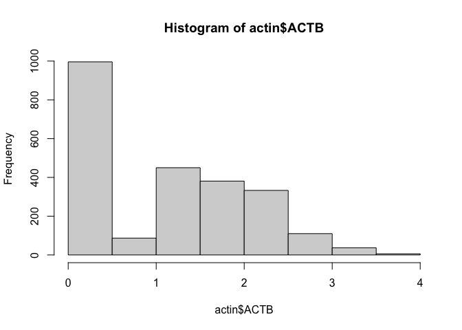
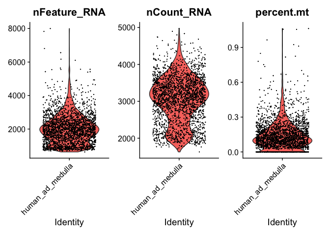

---
output:
  html_document:
    keep_md: yes
---


# 1. Standard Preprocessing using Seurat


Some standard steps are usually carried out in scRNA-Seq prior to further analysis as QC, dimensional
reduction and marker visualization. Here, we will use the Seurat R package to perform these steps which
is increasingly becoming the most popular tool, however, there are some other options as SingleCellExperiment
in R and scanpy available for python. First, we need to define a Seurat object.


## Creating Seurat object

We create a Seurat object using the `CreateSeuratObject` function as follows. Use the `?function` helper
in R to get information about the parameters that are need to be provided to the function.

 * counts - a count matrix. It can be a matrix, sparse matrix or dataframe.
 * project - A single character string. Correspond to a arbitrary name to label the object.
 * assay - A single character string. An arbitrary name that usually is assigned to label the
            type of sequencing information, for example, RNA, spliced RNA, ATAC, etc...
 * min.cells - An integer. Indicates a threshold of the number of cells for which a feature was
              recorded. Cells below that threshold will be filtered out.
 * min.features - An integer. Similar to min cells but for the number of features of a cell.
 


``` r
ad_medula_seurat <- CreateSeuratObject(
  counts = counts, 
  project = 'human_ad_medulla', 
  assay = 'RNA', 
  min.cells = 1, 
  min.features = 1
)
Idents(ad_medula_seurat) <- 'human_ad_medulla'
```

The variable `ad_medula_seurat` now contains the Seurat object that we can feed into the package.
If we print the variable we get information about the number of genes and cells.


``` r
ad_medula_seurat
```

```
## An object of class Seurat 
## 25064 features across 2400 samples within 1 assay 
## Active assay: RNA (25064 features, 0 variable features)
##  1 layer present: counts
```


## Exploring the Seurat object


Seurat objects can be seen as a container of different features. At this step it contains
our gene expression matrix, but in addition it can store metadata, processed data,
information from different assays, for example, scATACSeq, scCITESeq or unspliced transcripts.

We can explore the seurat object using the `$` to explore its *metadata* in combination with the tab 
key. For example, during the creation of the seurat object the number of counts quality metric
is calculated and added to the metadata. We can explore this metric by accessing the metadata
as follows.


``` r
ad_medula_seurat$nCount_RNA %>% head
```

```
## AAACGCTGTCAAAGTA_1 AAAGGATCAGATCACT_1 AAAGGATCAGCAGAAC_1 AACAACCAGTCCTACA_1 
##           2673.072           2563.070           2593.677           3183.051 
## AACAAGAAGGACTTCT_1 AACAAGATCTGCGTCT_1 
##           2718.732           3705.433
```


 We can do the same with the `@` operator to explore the different *slots*. For example,
 we can extract the original count matrix that we used to create the seurat object as follows:
 
 


``` r
ad_medula_seurat@assays$RNA$counts[1:5, 1:5]
```

```
## 5 x 5 sparse Matrix of class "dgCMatrix"
##               AAACGCTGTCAAAGTA_1 AAAGGATCAGATCACT_1 AAAGGATCAGCAGAAC_1
## RP11-34P13.7                   .                  .                  .
## AL627309.1                     .                  .                  .
## AP006222.2                     .                  .                  .
## RP4-669L17.10                  .                  .                  .
## RP5-857K21.2                   .                  .                  .
##               AACAACCAGTCCTACA_1 AACAAGAAGGACTTCT_1
## RP11-34P13.7                   .                  .
## AL627309.1                     .                  .
## AP006222.2                     .                  .
## RP4-669L17.10                  .                  .
## RP5-857K21.2                   .                  .
```


## Extracting expression values 


Next, we visualize gene counts to see its behavior. We take a look at the expression of the 
house keeping gene ACTIN Beta and plot an histogram of count values. We will use the
the function `FetchData` which is used to extract values from selected features in the Seurat
object and then plot it using an histogram.


``` r
actin <- FetchData(ad_medula_seurat, vars = 'ACTB')
hist(actin$ACTB)
```

<!-- -->

# 2. Quality control

# Quality control


Filtering cells with low sequencing quality is a very important step since it can greatly
impact in further analysis. Quality check and control often requires to visualize and inspect
samples in order to determine appropiate thresholds. Threshold values might vary from one 
dataset to another, so no hard threshold rule can be applied equally to every case.

We will examine the number of UMI counts, the number of RNA features and the percentage of reads 
of mitochondrial genes.

We will first calculate the percentage of UMI counts of reads mapped to mitochondrial genes. This
step most be manually done since is based on a *priori knowledge* of which genes corresponds to
mitochondrial genes. 
In this case, genes are annotated using human ensembl gene symbol annotations mitochondrial 
genes are annotated starting with a `MT-` string.


``` r
ad_medula_seurat[["percent.mt"]] <- PercentageFeatureSet(ad_medula_seurat, pattern = "^MT-")
```

Then, we can visualize the following metrics.

 * Number of features - Correspond to the number of different mapped genomic features. For example, in the
 case of scRNA-Seq features corresponds to genes, in ATAC-Seq to genomic ranges, etc. High number of features
 can indicate doublets and empty cells. Usually between 1 and 30000.
 
 * Number of counts - Number of mapped reads. It can also indicate the presence of doublets and empty 
droplet. It's generally correlated to the number of features. Usually between 1 and 20000.
 
 * Percentage of mitochondrial genes - Percentage of mapped reads that are annotated to mitochondrial
 genes. The presence of high levels of % of mitochondrial genes can suggest that a cell have lost
 its membrane integrity or that the cytoplasm has been leaked off and only the mitochondria was retained.
Usually a range from 0 to 10 is aceptable.


We can plot these metrics using the function `VlnPlot()` as follows:


``` r
VlnPlot(ad_medula_seurat, 
        features = c('nFeature_RNA', 'nCount_RNA', 'percent.mt'))
```

<!-- -->

The violin plots show the values of the metrics for each cell along with an adjusted violin 
distribution.

## Filtering out cells

Based on the previous violin plots we can define some thresholds and filter out cells using
the `subset` function. In the following code we select cells having nFeatures < 1250, 
nCount < 4000 and percentage of reads mapped to mitochondrial genes < 5 percent.


``` r
ad_medula_seu_filtered <- subset(ad_medula_seurat, 
                           nFeature_RNA < 4000 &
                                nCount_RNA < 4000 & 
                                    percent.mt < 5)
```

We can check the number of cell that passed the QC.


``` r
ncol(ad_medula_seu_filtered)
```

```
## [1] 2287
```


## Normalization

There are several methods for normalization of scRNA-Seq data. A commonly
used strategy is the log normalization which basically corrects sequencing
deep in cells by dividing each feature by the total number of counts and
then multiplied the result by a factor, usually 10000, and finally the
values are log transformed.

Log normalization can be implemented by using the `NormalizeData()` function.


``` r
ad_medula_seu_filtered <- NormalizeData(ad_medula_seu_filtered)
```

Then, in order to make genes measurements more comparable log transformed
values are scaled in a way that the media is equal to zero and the variance
is equal to 1 as follows:


``` r
ad_medula_seu_filtered <- ScaleData(ad_medula_seu_filtered)
```


## Quizzes


**QUIZ 1**

<details>
<summary> How are the number of features and UMI counts related?
<br>
a) They are not related and randomly distributed in a scatter plot
<br>
b) They are related in a non-linear way
<br>
c) They are linearly related
<br>
TIP: Use the function FeatureScatter, inspect the manual using ?function.
</summary>
<br>
<b>Answer:</b>
<br>
<code>FeatureScatter(ad_medula_seu_filtered, feature1 = "nCount_RNA", feature2 = "nFeature_RNA")</code>

We observe as expected a linear relation between the number of UMI counts and the 
features recorded.

</details> 


**QUIZ 2**


<details>
<summary>
What is the mean and median values of the percentage of mitochondrial reads?

1. mean=2.2133 and median=2.0532
2. mean=0.14005 and median=0.11719
3. mean=0.0102 and median=1.1743
</summary>

<code>
summary(ad_medula_seu_filtered@meta.data$percent.mt)</code>
<code>
<br>
   Min. 1st Qu.  Median    Mean 3rd Qu.    Max. 
<br>
0.00000 0.05833 0.11719 0.14005 0.19174 1.06252 
 </code>

</details>


[Previous Chapter (Seurat)](./01-Seurat.md)|
[Next Chapter (Feature selection)](./03-Feature_selection.md)


