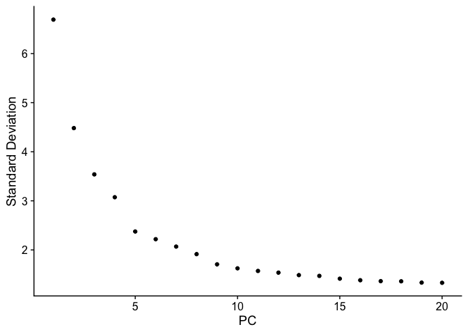

---
output:
  html_document:
    keep_md: yes
---


# Dimensional Reduction


The size of scRNA-Seq matrices can be huge and for this reason techniques to reduce the dimensionality
of this data are used. Here, we will use PCA, a very common techniques for dimension
reduction and visualization.

We will run a PCA using the already calculated top 1000 HVGs using the function `RunPCA()`.


``` r
ad_medula_filtered <- RunPCA(ad_medula_filtered, 
                        features = VariableFeatures(ad_medula_filtered))
```

We can assess the dimensionality, a measure of the complexity, by using an
elbow plot of the standard deviation for each principal component (PC)
from the PCA.

We will use the function `ElbowPlot()`.


``` r
ElbowPlot(ad_medula_filtered)
```

<!-- -->


The PC components in a PCA reflects corresponds to the directions in which
more variability is observed. These PCs are ranked by using the eigenvalues
of the covariance matrix. We can the plot a Elbow or joystick plot of the 
standard deviation and the rank of each PC. Top ranked PCs are expected to 
have higher values of variability and then to gradually decrease. So, we
can use the elbow plot representation to keep PCs from the top to the bottom
until we do not see further variability changes, in these case we can use 
the number of PC equal to 7.


## Quizzes

### Quizz 1

<details>
<summary> <b>Which command(s) can be used to extract the PCA matrix from the seurat object?</b>
<br>

1. <code>pca <- Embeddings(ad_medula_filtered, reduction = 'pca')</code>
2. <code>pca <- ad_medula_filtered@reductions$pca@feature.loadings</code>
3. <code>pca <- ad_medula_filtered@reductions$pca@cell.embeddings</code>
</summary>
TIP: Use str(ad_medula_filtered) to explore the slots present in the seurat object.
</details>

### Quiz 2

<details>
<summary>
Look at the feature loadings of the principal components. Which are the genes with the highest/lowest loadings for PC1?

1. highest: SLC35F1, NRCAM, CSMD1, FGF14, BRINP3, KCND2 lowest: CNTNAP4, SPP1, LOC100507336, SLC7A14-AS1, LINC01608, MOBP  
2. highest: DPP6, CACNA2D3, FGF14, SYT1, CNTN1, EML5. lowest: INSC, SLC35F1, COL5A2, IL1RAPL1, PTPRZ1, CDH19  
3. highest: C2CD2L,C16orf58,CENPL,ZNF181,RABL5 lowest: INO80D,CHST2,OAF,LAGAP2YZ,ADRB2 

</summary>
<code>
> `ad_medula_filtered@reductions$pca@feature.loadings %>% as.data.frame() %>% arrange(desc(PC_1)) %>% head %>% rownames()`
<br>
[1] "DPP6"     "CACNA2D3" "FGF14"    "SYT1"     "CNTN1"    "EML5"
> `ad_medula_filtered@reductions$pca@feature.loadings %>% as.data.frame() %>% arrange(desc(PC_1)) %>% tail() %>% rownames()`
<br>
[1] "INSC"     "SLC35F1"  "COL5A2"   "IL1RAPL1" "PTPRZ1"   "CDH19"
</code>
</details>


[Previous Chapter (Feature selection)](./03-Feature_selection.md)|
[Next Chapter (Clustering)](./05-Cluster_visualization.md)


