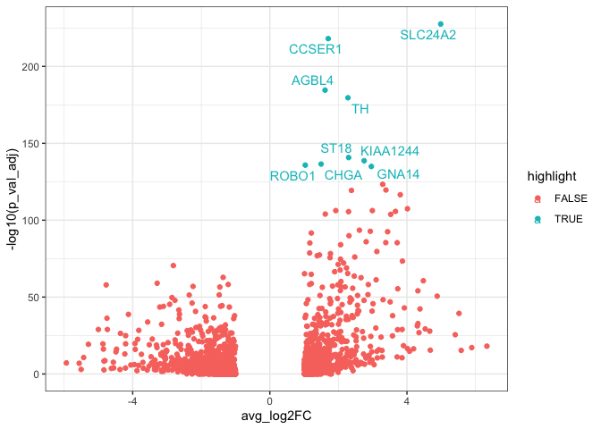

---
output:
  html_document:
    keep_md: yes
---


# Differential Expression Analysis

The main advantage of using scRNA-Seq technologies is the possibility of 
assessing cell type specificity and heterogeneity, which is not possible while
using bulk assays. 

We should expect that some of the identified clusters in the UMAP might correspond
to distinct cell types. The assignation of cell types identities is not always
straightforward, some clusters might still contain some variability, and 
additionally, different clusters might correspond to the same cell type at a
different functional, metabolic or cycling point. 

Cell type profiling is generally done by assessing the expression of markers. 
This task can be done manually by inspecting markers in dimensional reduced data
projected in UMAP or tSNE. It can also be done in a automatic manner scoring 
cells using gene signatures, which are lists of marker genes. Scores are generally
based in the median expression of all the markers. Using scores has the advantage
or reducing bias due to the arbitrary selection of markers.

Finding differential expressed markers is important for cluster profiling and
identification. We will use the `FindAllMarkers()` function, which performs
a statistical test comparing the distribution of gene expression values for 
each gene separately comparing one assigned cell type cluster (in this case 
the `seurat_clusters` column) *vs* the rest of cells. 

First, we will set up the column used to define the clusters using the 
function `Idents()`. 


``` r
Idents(ad_medula_filtered) <- ad_medula_filtered$seurat_clusters
```

Now we can calculate the DEGs. 
There are several parameters for `FindAllMarkers()`, we will discuss
`logfc.threshold`, `min.pct` and `min.cells.feature` that corresponds to the threshold of gene
expression fold change, the minimum percentage of cells expressing the marker 
and the minimum of cells expressing (counts > 0) the feature. These parameters 
are used to filter out genes prior calculating DEGs. Lowering the values of these
parameters will increase the sensibility of the method at the expense of 
increasing computation time.


``` r
ad_medula.degs <- FindAllMarkers(ad_medula_filtered, 
                            logfc.threshold = 1, 
                            min.pct = 0.05, 
                            min.cells.feature = 10, 
                            verbose = FALSE)
```


The output `ad_medula.degs` consist of a data frame contanning the DEGs with
p-vales, p-adjusted values and log fold change values for each gene as 
we can see next:


``` r
head(ad_medula.degs)
```

```
##                  p_val avg_log2FC pct.1 pct.2     p_val_adj cluster     gene
## SLC24A2  1.103268e-232   4.983958 0.631 0.031 2.765231e-228       0  SLC24A2
## CCSER1   3.469903e-223   1.702038 0.990 0.488 8.696964e-219       0   CCSER1
## AGBL4    1.053599e-189   1.610500 0.963 0.476 2.640739e-185       0    AGBL4
## TH       1.021532e-184   2.278201 0.854 0.281 2.560368e-180       0       TH
## ST18     7.427605e-146   2.297766 0.739 0.212 1.861655e-141       0     ST18
## KIAA1244 8.635505e-144   2.750580 0.646 0.143 2.164403e-139       0 KIAA1244
```


We can make a vulcano plot using `ggplot`:


``` r
library(ggplot2)
library(dplyr)         ## for handling data frames
library(ggrepel)

ad_medula.degs %>%
  filter(cluster=='0') %>%
  filter(p_val_adj > 0) %>%
  arrange(desc(abs(avg_log2FC))) %>%       ## Arranging genes by FC
  mutate(highlight=ifelse(-log10(p_val_adj)>280, TRUE, FALSE)) %>% ## highlighting top FC markers
  mutate(gene_label=ifelse(highlight==TRUE, gene, '')) %>% ## Adding labels for top markers
  ggplot(aes(x=avg_log2FC, y=-log10(p_val_adj),
             colour=highlight,
             label=gene_label)) +         ## adding labels for top markers
      geom_point() +
      geom_text_repel() +
      theme_bw()
```

<!-- -->


## Exercises

> What does this plot represent? Can you make the equivalent volcano plot for the other clusters?


[Previous Chapter (Cluster Visualization)](./05-Cluster_visualization.md)|
[Next Chapter (Profiling cells)](./06-Profiling_cells.md)
