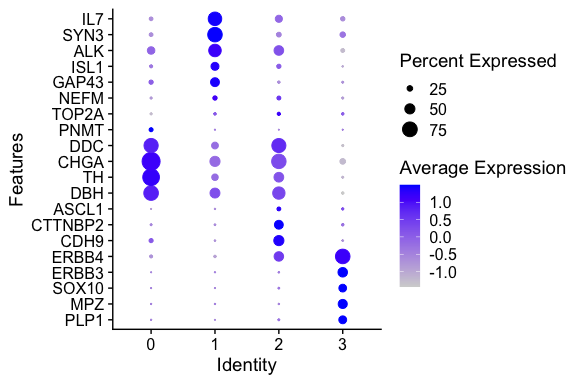
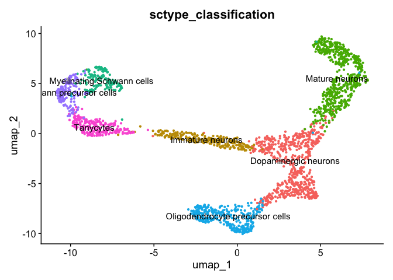

---
output:
  html_document:
    keep_md: yes
---


# Profiling cells


First, we will take top 10 ranked genes based in Log FC and visualize their
expression in clusters using a heatmap representation.


``` r
top10 <- ad_medula.degs %>% 
             group_by(cluster) %>% 
             top_n(n = 10, wt = avg_log2FC)
DoHeatmap(ad_medula_filtered, 
          features = top10$gene) + NoLegend()
```

<!-- -->


We can visualize additional known canonical markers as used in Janski S et al, 2021 
in order to assign cell categories. 


``` r
canonical_markers <- c(
  "PLP1",
  "MPZ",
  "SOX10",
  "CDX19",
  "ERBB3",
  "ERBB4",
  "CDH9",
  "CTTNBP2",
  "ASCL1",
  "DBH",
  "TH",
  "CHGA",
  "DDC",
  "PNMT",
  "TOP2A",
  "NEFM",
  "GAP43",
  "SMTN2",
  "ISL1",
  "ALK",
  "SYN3",
  "IL7"
)
```


## Visualization of gene expression levels of markers in clusters

We can visualize the expression of the different markers in clusters
using violin plots using the `VlnPlot()` function as follows:


``` r
DotPlot(ad_medula_filtered, 
            features = canonical_markers) +
      coord_flip()
```

```
## Warning: The following requested variables were not found: CDX19, SMTN2
```

```
## Warning: Scaling data with a low number of groups may produce misleading
## results
```

<!-- -->

Because of the signal dropout it's hard to say what is the proportion of cells that are actually
expressing a marker. Dotplots are commonly used to visualize both gene expression levels alongside 
with the frequency of cells expressing the marker. The `DotPlot()` function comes at handy.


## Cell type labelling


The genes CHGA, DBH and TH are markers of Chromaffin cells while IL7 and
SYN3 are expressed in Late Neuroblasts. CDH9 and CTTNBP2 are mostly 
expressed in Bridge cells and ERBBP3 and ERBBP4 are present in SCPs cells.

Now, we will annotate the cells with their identified identities in the seurat 
object. We will map the cluster names as follows:

**Beware: your UMAP might look slightly different! So please adapt the cluster<>cell type mapping according to your results! For example, you might have more/less clusters!**


``` r
mapping <- data.frame(seurat_cluster=c('0', 
                                       '1', 
                                       '2',
                                       '3'),
                      cell_type=c('Chromaffin cells', 
                                  'Late neuroblasts', 
                                  'Bridge',
                                  'SCP'))
mapping
```

```
##   seurat_cluster        cell_type
## 1              0 Chromaffin cells
## 2              1 Late neuroblasts
## 3              2           Bridge
## 4              3              SCP
```

To assign the new labels we can use the map function from the plyr R package
as follows:


``` r
ad_medula_filtered$'cell_type' <- plyr::mapvalues(
  x = ad_medula_filtered$seurat_clusters,
  from = mapping$seurat_cluster,
  to = mapping$cell_type
)
```


Now, we can plot the clusters with the assigned cell types.


``` r
DimPlot(ad_medula_filtered, 
        group.by = 'cell_type',   ## set the column to use as category
        label = TRUE, reduction = 'umap')  +          ## label clusters
        NoLegend()                ## remove legends
```

<!-- -->


## Cell profiling automation

There are several tools for the automation of cell type identification, for example,
sctype, singleR, CellAssign, etc. In general, they use a reference in the form of a previously 
curated dataset and transfer information to a query dataset. Here, we will quickly
exemplified the sctype R library. 


``` r
invisible({
  library(openxlsx)
  library(HGNChelper)
})
```

```
## Please cite our software :) 
##  
##  Sehyun Oh et al. HGNChelper: identification and correction of invalid gene symbols for human and mouse. F1000Research 2020, 9:1493. DOI: https://doi.org/10.12688/f1000research.28033.1 
##  
##  Type `citation('HGNChelper')` for a BibTeX entry.
```

``` r
source("https://raw.githubusercontent.com/IanevskiAleksandr/sc-type/master/R/sctype_wrapper.R") 

ad_medula_filtered <- FindClusters(ad_medula_filtered, 
                            resolution = 1, 
                            verbose = FALSE)

sample <- run_sctype(ad_medula_filtered, 
                     assay = "RNA", 
                     scaled = TRUE, 
                     known_tissue_type="Brain",
                     custom_marker_file="https://raw.githubusercontent.com/IanevskiAleksandr/sc-type/master/ScTypeDB_short.xlsx", 
                     name="sctype_classification")
```

```
## Warning in checkGeneSymbols(markers_all): x contains non-approved gene symbols
## Warning in checkGeneSymbols(markers_all): x contains non-approved gene symbols
## Warning in checkGeneSymbols(markers_all): x contains non-approved gene symbols
## Warning in checkGeneSymbols(markers_all): x contains non-approved gene symbols
## Warning in checkGeneSymbols(markers_all): x contains non-approved gene symbols
## Warning in checkGeneSymbols(markers_all): x contains non-approved gene symbols
## Warning in checkGeneSymbols(markers_all): x contains non-approved gene symbols
## Warning in checkGeneSymbols(markers_all): x contains non-approved gene symbols
## Warning in checkGeneSymbols(markers_all): x contains non-approved gene symbols
## Warning in checkGeneSymbols(markers_all): x contains non-approved gene symbols
## Warning in checkGeneSymbols(markers_all): x contains non-approved gene symbols
## Warning in checkGeneSymbols(markers_all): x contains non-approved gene symbols
## Warning in checkGeneSymbols(markers_all): x contains non-approved gene symbols
## Warning in checkGeneSymbols(markers_all): x contains non-approved gene symbols
## Warning in checkGeneSymbols(markers_all): x contains non-approved gene symbols
## Warning in checkGeneSymbols(markers_all): x contains non-approved gene symbols
## Warning in checkGeneSymbols(markers_all): x contains non-approved gene symbols
## Warning in checkGeneSymbols(markers_all): x contains non-approved gene symbols
## Warning in checkGeneSymbols(markers_all): x contains non-approved gene symbols
## Warning in checkGeneSymbols(markers_all): x contains non-approved gene symbols
## Warning in checkGeneSymbols(markers_all): x contains non-approved gene symbols
## Warning in checkGeneSymbols(markers_all): x contains non-approved gene symbols
```

```
## [1] "Using Seurat v5 object"
## [1] "New metadata added:  sctype_classification"
```


Let's inspect again the metadata.


``` r
head(sample@meta.data)
```

```
##                          orig.ident nCount_RNA nFeature_RNA percent.mt
## AAACGCTGTCAAAGTA_1 human_ad_medulla   2673.072         1347 0.22453995
## AAAGGATCAGATCACT_1 human_ad_medulla   2563.070         1226 0.07635909
## AAAGGATCAGCAGAAC_1 human_ad_medulla   2593.677         1254 0.00000000
## AACAACCAGTCCTACA_1 human_ad_medulla   3183.051         1871 0.14112372
## AACAAGAAGGACTTCT_1 human_ad_medulla   2718.732         1391 0.06546350
## AACAAGATCTGCGTCT_1 human_ad_medulla   3705.433         2811 0.08209384
##                    RNA_snn_res.0.1 seurat_clusters        cell_type
## AAACGCTGTCAAAGTA_1               1               0 Late neuroblasts
## AAAGGATCAGATCACT_1               1               0 Late neuroblasts
## AAAGGATCAGCAGAAC_1               2               1           Bridge
## AACAACCAGTCCTACA_1               2               1           Bridge
## AACAAGAAGGACTTCT_1               2               1           Bridge
## AACAAGATCTGCGTCT_1               3               4              SCP
##                    RNA_snn_res.1 sctype_classification
## AAACGCTGTCAAAGTA_1             0        Mature neurons
## AAAGGATCAGATCACT_1             0        Mature neurons
## AAAGGATCAGCAGAAC_1             1  Dopaminergic neurons
## AACAACCAGTCCTACA_1             1  Dopaminergic neurons
## AACAAGAAGGACTTCT_1             1  Dopaminergic neurons
## AACAAGATCTGCGTCT_1             4             Tanycytes
```


Now we see a new column called `sctype_classification` which contains the labels 
annotated to each cell type. Let's plot now this annotations in a UMAP.


``` r
DimPlot(sample, 
        group.by = 'sctype_classification', 
        label = TRUE) + NoLegend()
```

<!-- -->


Does it look similar to our previous conclusions?


## Final Report

## Exercise 


> Using the scRNA-Seq workflow in this pipeline, process a data regarding PBMC cells 
stimulated with IFN beta
> Load the seurat object containing the data to a variable named `ifnb` using the following commands:

```
url_ifn <- 'https://github.com/caramirezal/caramirezal.github.io/blob/master/bookdown-minimal/data/pbmc_ifnb_stimulated.seu.rds?raw=true'
ifnb <- readRDS(url(url_ifn))
```

> This data is downsampled from the [Kang HM et al, 2017 data](https://www.nature.com/articles/nbt.4042). Provide a report in a Rmd file.   


[Previous Chapter (Differential expression)](./06-Differential_Expression.md)|
[Next Chapter (Pseudotime analysis)](./08-Intro_to_pseudotime_analysis.md)

