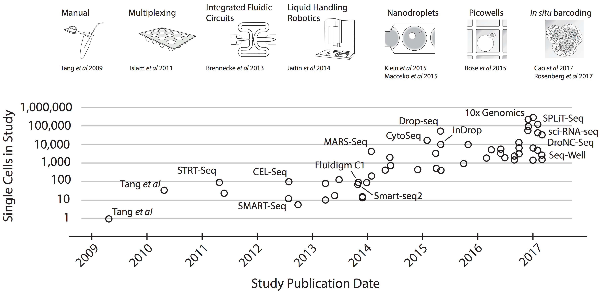

---
output:
  html_document:
    keep_md: yes
---


```{r, include=FALSE}
library(Matrix)
```


# 0. First steps in scRNA-Seq analysis 


We will use available data from adrenal medulla [Janski, et al 2021](https://www.nature.com/articles/s41588-021-00806-1). In order
to speed up the process only a subset of 2400 cells are going to be processed here. Here, we will
perform the following tasks:

* Definition of a Seurat object from a matrix of counts
* Quality Control (QC) of the cell samples
* Filtering
* Dimensional reduction
* Clustering
* Differential expression
* Visualization of markers


## Single Cell Sequencing

Single cell sequencing (scRNA-Seq) technologies arise from bulk counterparts with 
the aim of refining gene expression profiles. Previous bulk Sequencing offered 
averaged quantifications of gene expression in samples. In some contexts, for 
example, when studying cell type specificity or the heterogeneity in tumours is 
important to dissect patterns in cell subpopulations.

The following image illustrates the development of scRNA-Seq technologies
and the number of cells that can be analyzed with each technology. In this 
course we will not discuss platform sequencing technologies in detail, 
instead we will take a hands on approach and jump directly to the analysis 
of scRNA-Seq data. However, the analysis that we show next are applied downstream 
to libraries construction or sequencing, and are therefore platform agnostic.




The image is taken from [Svensson V et al, 2017](https://arxiv.org/abs/1704.01379).


## Quantifying gene expression in single cells


Genes are expressed in cells by the synthesis of mRNA molecules. Quantification of gene expression
in single cells consists of counting and mapping sequenced reads to each gene in each cell. The 
outcome of this process is a count matrix, which is a discrete matrix of integers corresponding
to the number of RNA molecules associated to each gene and cell. The count matrix usually has 
genes as rows and cells in columns. 

In the next lines we will load the matrix of UMI counts into a variable called `counts`. 


```{r, loading_mtx}
## If the url/internet doesn't work you can use a local copy
## of the data, just set the local path here
#ad_medula_path <- "/Users/cbg-mbp-02/Documents/data/janski_2021/"
# Read matrix
#counts <- readMM(file.path(ad_medula_path, "counts_subset_2400_cells.mtx"))

url <- "https://raw.githubusercontent.com/caramirezal/caramirezal.github.io/master/courses/data/counts_subset_2400_cells.mtx"
counts <- readMM(url(url))
counts <- as.matrix(counts)

# Read cell and gene names
cells <- read.delim(
  #file.path(ad_medula_path, "cells_subset_2400_cells.tsv"),   ## if it doesn't work, define a local path
  "https://raw.githubusercontent.com/hdsu-bioquant/r4sc2024/r4sc_june2026/day1/day1_updated/data/cells_subset_2400_cells.tsv",
  header = TRUE,
  stringsAsFactors = FALSE
)
#head(cells)

genes <- read.delim(
  #file.path(ad_medula_path, "genes_subset_2400_cells.tsv"),
  "https://raw.githubusercontent.com/hdsu-bioquant/r4sc2024/r4sc_june2026/day1/day1_updated/data/genes_subset_2400_cells.tsv",
  header = FALSE,
  stringsAsFactors = FALSE
)
#head(genes)

# Assign row and column names
rownames(counts) <- genes$V1
colnames(counts) <- cells$cell_id
```


As can be seen from the output of the function `dim(counts)` the matrix contains 13,714 rows (genes) and  columns (cells). 


```{r, dim_brain, message=FALSE, warning=FALSE}
dim(counts)
```


To have a glimpse of the appearance of this matrix we print the first 5 rows and first 5 columns. It can
be seen that the matrix object is a particular array called sparse Matrix. These types of matrices are 
specially efficient to store numerical arrays which are very sparse (full of zeroes) as is the case
for single cell count matrices data.


```{r, slicing_data}
counts[1:5, 1:5]
```


We can start from different types of arrays apart from sparse matrices as data frames or hd5 
objects, just to give some examples. The format in which the matrix is provided might also vary from 
excel files, tsv, csv, rds, etc. Usually this formats can be converted into each other, however, the
methods for such transformation are so different and specific that we cannot covered here all of them
here.


## Quizzes

> Manipulation of count matrices

<!-- Quizz 1-->
**QUIZ 1**

<details>
<summary> What is the mean and median number of UMI counts in these cells?
<br>
 a) median = 301, mean = 343
<br>
 b) median = 3130, mean = 3056
<br>
 c) median = 2216, mean = 2354
</summary>
<br>
<b>Answer:</b>
<br>
umi.sum <- apply(counts, 2, sum)
<br>
summary(umi.sum)

`Min. 1st Qu.  Median    Mean 3rd Qu.    Max.` <br>
`191    2215    3754    5520    6588   48150`  
</details> 


<!-- Quizz 2-->

**QUIZ 2**

<details>
<summary> What are the top genes with the highest number of UMI counts in decreasing order?
<br>
 a) MALAT1, PCDH9, CADM2, NRXN1, LSAMP, IL1RAPL1
<br>
 b) MALAT1, MEG3, BAI3, AUTS2, RBMS3, FAM155A
<br>
 c) B2M, TMSB4X, RPL13A, RPL10, RPL13, MALAT1
</summary>
TIP: You can use the same approach from the previous quizz but now using rows.
<br>
umi.sum <- apply(counts, 1, sum)
<br>
sort(umi.sum, decreasing = TRUE) %>% head()
<br>
</details>


<!-- Quizz 3-->
**QUIZ 3**

<details>
<summary> Evaluate the degree of zero inflation in the data. Calculate the fraction of zeros in the count matrix.
<br>
 a) 0.3105930
<br>
 b) 0.9296397
<br>
 c) 0.7485923
 </summary>
TIP: Calculate the number of entries that are zero as follows: `sum(counts==0)`.
And then divide by the total number of entries in the matrix.

`sum(counts==0)/prod(dim(counts))`
`0.9296397`
</details>


<br>

[Next Chapter (Seurat)](./01-Seurat.md)