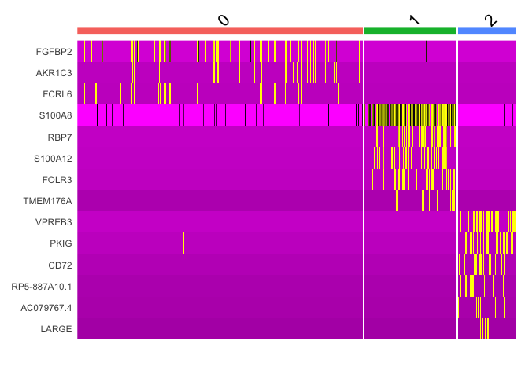
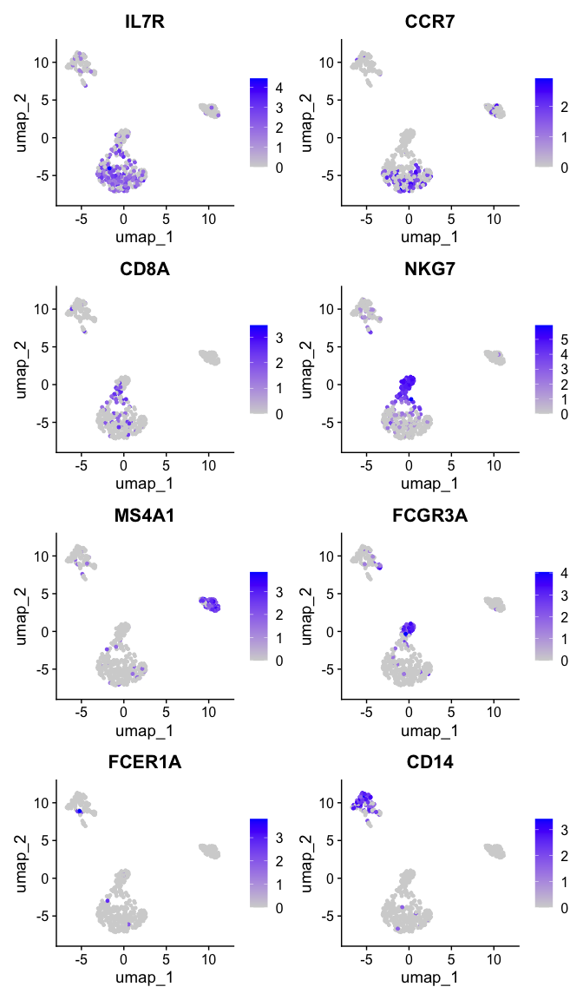
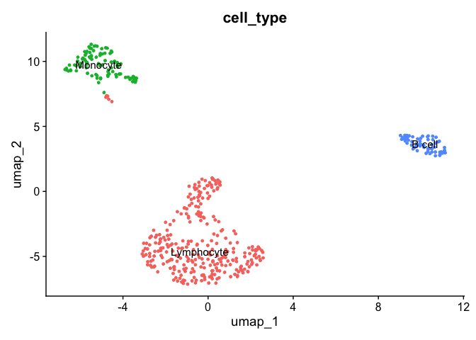
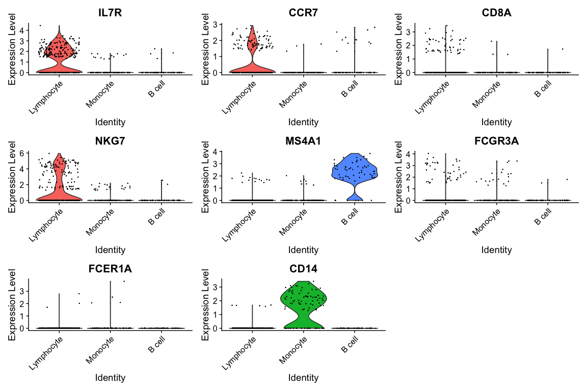
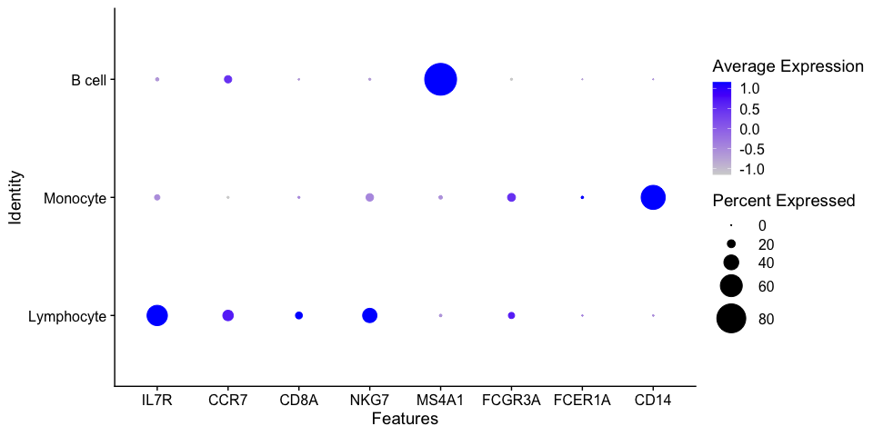
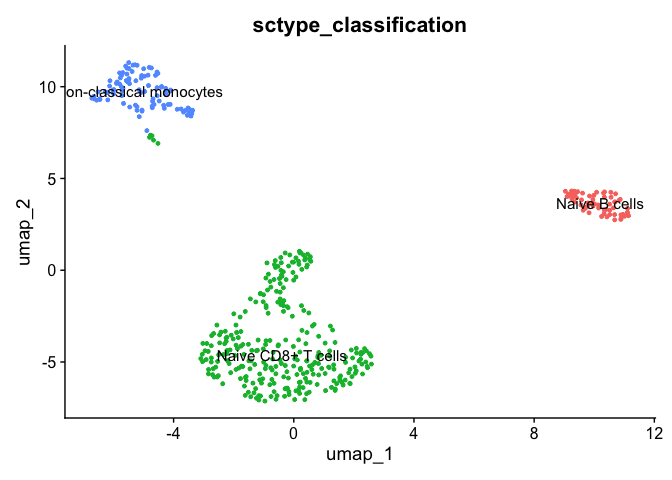

---
output:
  html_document:
    keep_md: yes
---


# Profiling cells


First, we will take top 10 ranked genes based in Log FC and visualize their
expression in clusters using a heatmap representation.


``` r
top10 <- pbmc.degs %>% 
             group_by(cluster) %>% 
             top_n(n = 10, wt = avg_log2FC)
DoHeatmap(pbmc.filtered, 
          features = top10$gene) + NoLegend()
```



IL-7 is a marker for naive CD4+ T cells, while GZMB is a marker for CD8 T cells.
Then, we can tentatively consider cluster 0 and 2 as CD4 and CD8 T cells,
respectively. 

We can visualize additional known canonical markers in order to assign cell
categories. 


``` r
canonical_markers <- c('IL7R',     ## CD4+ cell
                       'CCR7',     ## Naive CD4+ T cell
                       'CD8A',     ## CD8+
                       'NKG7',     ## NK
                       'MS4A1',    ## B cell marker
                       'FCGR3A',   ## Mono
                       'FCER1A',   ## DC
                       'CD14'     ## Mono
                       )

FeaturePlot(pbmc.filtered, 
            features = canonical_markers,
            ncol = 2)
```



Now, we will annotate the cells with their identified identities in the seurat 
object. We will map the cluster names as follows:

**Beware: your UMAP might look slightly different! So please adapt the cluster<>cell type mapping according to your results! For example, you might have more/less clusters!**

``` r
mapping <- data.frame(seurat_cluster=c('0', '1', '2'),
                      cell_type=c('Lymphocyte', 
                                  'Monocyte', 
                                  'B cell'))
mapping
```

```
##   seurat_cluster  cell_type
## 1              0 Lymphocyte
## 2              1   Monocyte
## 3              2     B cell
```

To assign the new labels we can use the map function from the plyr R package
as follows:


``` r
pbmc.filtered$'cell_type' <- plyr::mapvalues(
  x = pbmc.filtered$seurat_clusters,
  from = mapping$seurat_cluster,
  to = mapping$cell_type
)
```


Now, we can plot the clusters with the assigned cell types.


``` r
DimPlot(pbmc.filtered, 
        group.by = 'cell_type',   ## set the column to use as category
        label = TRUE)  +          ## label clusters
        NoLegend()                ## remove legends
```




## Visualization of gene expression levels of markers in clusters

We can visualize the expression of the different markers across identified clusters
using violin plots using the `VlnPlot()` function as follows:


``` r
VlnPlot(pbmc.filtered, 
        features = canonical_markers,
        group.by = 'cell_type')
```




Because of the signal dropout it's hard to say what is the proportion of cells that are actually
expressing a marker. Dotplots are commonly used to visualize both gene expression levels alongside 
with the frequency of cells expressing the marker. The `DotPlot()` function comes at handy.


``` r
DotPlot(pbmc.filtered, 
        features = canonical_markers, 
        group.by = 'cell_type', 
        dot.scale = 12)
```




## Cell profiling automation

There are several tools for the automation of cell type identification, for example,
sctype, singleR, CellAssign, etc. In general, they use a reference in the form of a previously 
curated dataset and transfer information to a query dataset. Here, we will quickly
exemplified the sctype R library. 


``` r
library(openxlsx)
library(HGNChelper)
source("https://raw.githubusercontent.com/IanevskiAleksandr/sc-type/master/R/sctype_wrapper.R") 
sample <- run_sctype(pbmc.filtered, 
                     assay = "RNA", 
                     scaled = TRUE, 
                     known_tissue_type="Immune system",
                     custom_marker_file="https://raw.githubusercontent.com/IanevskiAleksandr/sc-type/master/ScTypeDB_short.xlsx", 
                     name="sctype_classification")
```

```
## [1] "Using Seurat v5 object"
## [1] "New metadata added:  sctype_classification"
```

Let's inspect again the metadata.


``` r
head(sample@meta.data)
```

```
##                  orig.ident nCount_RNA nFeature_RNA percent.mt RNA_snn_res.0.1
## AAAGAGACGGACTT-1       PBMC       1151          457   2.345786               0
## AAAGTTTGATCACG-1       PBMC       1268          444   3.470032               2
## AAATGTTGTGGCAT-1       PBMC       2761         1017   1.919594               1
## AAATTCGAGCTGAT-1       PBMC       2969          980   2.189289               1
## AAATTGACTCGCTC-1       PBMC       3411         1013   1.495163               0
## AACAAACTCATTTC-1       PBMC       2178          731   1.423324               0
##                  seurat_clusters  cell_type   sctype_classification
## AAAGAGACGGACTT-1               0 Lymphocyte      Naive CD8+ T cells
## AAAGTTTGATCACG-1               2     B cell           Naive B cells
## AAATGTTGTGGCAT-1               1   Monocyte Non-classical monocytes
## AAATTCGAGCTGAT-1               1   Monocyte Non-classical monocytes
## AAATTGACTCGCTC-1               0 Lymphocyte      Naive CD8+ T cells
## AACAAACTCATTTC-1               0 Lymphocyte      Naive CD8+ T cells
```

Now we see a new column called `sctype_classification` which contains the labels 
annotated to each cell type. Let's plot now this annotations in a UMAP.


``` r
DimPlot(sample, 
        group.by = 'sctype_classification', 
        label = TRUE) + NoLegend()
```




Does it look similar to our conclusions?


## Final Report

## Exercise 


> Using the scRNA-Seq workflow in this pipeline, process the provided dataset of PBMC cells 
stimulated with IFN beta
> Load the seurat object containing the data to a variable named `ifnb` using the following commands:

```
url_ifn <- 'https://github.com/caramirezal/caramirezal.github.io/blob/master/bookdown-minimal/data/pbmc_ifnb_stimulated.seu.rds?raw=true'
ifnb <- readRDS(url(url_ifn))
```

> This data is downsampled from the [Kang HM et al, 2017 data](https://www.nature.com/articles/nbt.4042). Provide a report in a Rmd file.   


[Previous Chapter (Differential expression)](./06-Differential_Expression.md)|
[Next Chapter (Pseudotime analysis)](./08-Intro_to_pseudotime_analysis.md)

