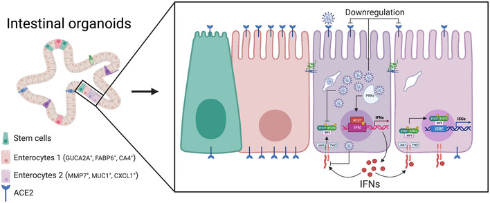
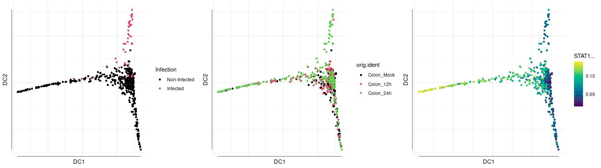

---
output:
  html_document:
    keep_md: yes
---

## Pseudotime analysis

While analyzing cells in a temporal context (e.g. developmental processes or time series experiments) we might like
to order cells in some manner with the aim of testing some hypothesis. Several algorithms has been developed to 
evaluate temporal dynamics, order cells and assign a pseudotime stimate of the position of the cells along
trajectories, for a review of these methods see [Deconinck L et al, 2021](https://www.sciencedirect.com/science/article/pii/S2452310021000299).

Here, we will briefly show the implementation of difussion maps to order single cells using the R package *destiny*.
As a show case, we use already published data of colon cells derived from organoids cultured using human samples 
[Triana S et al, 2021](https://pubmed.ncbi.nlm.nih.gov/33904651/). 

Intestinal tissues like colon and illeum contain several different cell types including enterocytes, stem cells,
transient amplifying (TA) subpopulations and goblet cells. During the COVID-19 pandemy, some of the first observed 
symptoms on SARS-CoV2 infected patients were related to diarrhea, vomiting, nausea, etc.. and posterior 
analysis showed that intestinal cells are permissive to viral infection. 

In this context, we wanted to evaluate differences in infected cells compared to bystander 
(non-infected cells) with respect of IFN secretion and IFN-stimulated genes (ISGs) expression (see figure). 

{width=2250px}


It's challenging to observe a clear grouping and dynamical relationships between infected and 
bystander cells probably ought to the fact that most of the differences in cells correspond to cell type features. 
In order to evaluate dynamical patterns in infected **vs** bystander subpopulations we order the cells and evaluate 
the activity of transcription factors which drive the IFN response.


First, we load necessary libraries and load input data. 


``` r
library(Biobase)
library(destiny)
library(dplyr)
library(gridExtra)
```


The input data can be downloaded using the following
link `https://figshare.com/s/a62e0084a4c9cc1402b4` and consist of a matrix of gene expression and metadata. We also visualize the activity of 
transcription factors calculated using the SCENIC algorithm, which is out of the scope now, but
in general this pipeline aims to measure how active TFs are by looking at the gene expression
of their targets.


``` r
### read expression values
colon.exp.file = "https://www.dropbox.com/scl/fi/xk2axyirstxvramury96d/colon_scenic_corrected_input.tsv?rlkey=anofkf7qurv77bdsm2rspymy7&st=ggf49h72&dl=1"
colon.exp = read.table(colon.exp.file,header=TRUE,row.names=1)
colon.exp = t(colon.exp)

## metadata
colon.meta.file = "https://www.dropbox.com/scl/fi/vrrzncs81qdah3mjdp4tw/colon_scenic_corrected_annotations.tsv?rlkey=ts44q3xafr6t77hmb9f3o3sfh&st=3dfoxy42&dl=1"
colon.meta = read.table(colon.meta.file,header=TRUE,row.names=1)

### read TF activities
colon.scenic.file = "https://www.dropbox.com/scl/fi/u8tvpmo2des04yx5vcetr/colon_aucell.csv?rlkey=6ox1vi4vtxpaxdrlh6ntcpju6&st=x4caj77g&dl=1"
colon.scenic = read.csv(colon.scenic.file,row.names=1,check.names = FALSE)

### check that the order of cells is comparable
## defining metatada object
#sum(rownames(colon.scenic) != rownames(colon.meta))  ## yes, they are!
colon.meta = data.frame(colon.meta,colon.scenic)
meta = AnnotatedDataFrame(colon.meta)
```

SARS-CoV2 transcripts were also quantified by targeted sequencing. Infected cells were defined as cells having viral expression
above a baseline threshold. The following table shows the number of infected and bystander cells defined using this
definition.


``` r
table(colon.meta$orig.ident,colon.meta$Infection)
```

```
##             
##              Infected Non-Infected
##   Colon_12h        34         2616
##   Colon_24h       103         2224
##   Colon_Mock        0         2171
```

It's kind of expected to observe an increase in viral infection at 24 hours. We load the gene expression data into a new object
of class BioBase used by the library of the same name. We restrict our computation to only enterocytes which
are the cell type which are the most permissive to viral infection.


``` r
eset = ExpressionSet(assayData = colon.exp,
                     phenoData = meta)

i.cell = which(pData(eset)$CellTypes == 'Inmature Enterocyte 2')

eset.sub = eset[,i.cell]  ## we remove the mock cells
```

Diffusion maps models cells dynamics by using markovian random walks. Cells are projected in a lower dimensional
space based in their probability to transit to each other. For more details, check out the [publication](https://academic.oup.com/bioinformatics/article/32/8/1241/1744143) 
of the *destiny* R package.

In order to focus in the IFN response we restricted the calculation to only genes in the IFN signalling 
pathway reported in the Reactome database.


``` r
ifn = read.table("https://www.dropbox.com/scl/fi/tbgc5ekq8yw59qblqfaf6/REACTOME_INF_SIGNALLING.txt?rlkey=l48en2r8v3fowcat80l2gq7mv&st=t799ecl5&dl=1",
                 as.is=TRUE)[,1]
i.top = which(rownames(eset.sub) %in% ifn) # take genes in the IFN pathway
```

Now, we calculate the difussion map.


``` r
# compute the diffusion map
dm = DiffusionMap(eset.sub[i.top,],n_pcs = 50)
```

... And plotting the embeddings.


``` r
p1 <- plot(dm, 1:2,col_by='Infection') 
p2 <-  plot(dm, 1:2,col_by='orig.ident') 
p3 <-  plot(dm, 1:2,col_by='STAT1...')

gridExtra::grid.arrange(p1,p2,p3, ncol=3)
```




From the projections we observe first that infected cells are localized mainly in one of the bifurcations of the 
difussion map. Interestingly, mock samples and 12 hours samples seems to be distributed in the bottom left part
bifurcation which suggest this branch represents early time points. Strikingly, STAT1 seems to be more active in bystander
cells compared to infected cells which suggest a modulation caused by the virus at later points.


## Quizzes

> Re-run the difussion map using another set of genes 

The files  `degs_imm_infected_vs_bystander_12_colon.rds` and `degs_imm_infected_vs_bystander_24_colon.rds` contain
list of differential expressed genes comparing infected vs bystander cells at 12 hours or 24 hours, respectively,
in immature enterocytes. Use both genes lists to compute the diffusion map and compare the output.

[Previous Chapter (Profiling cells)](./07-Profiling_cells.md)|
