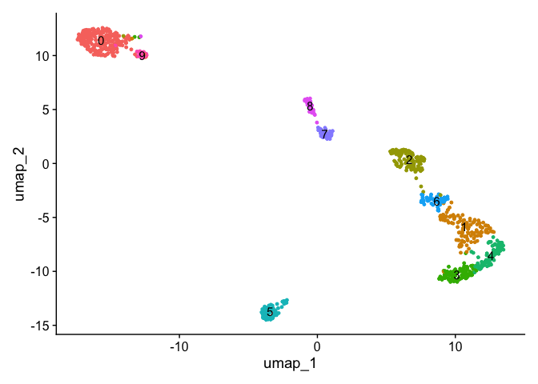
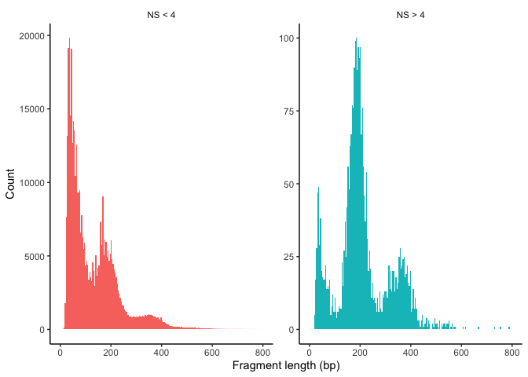
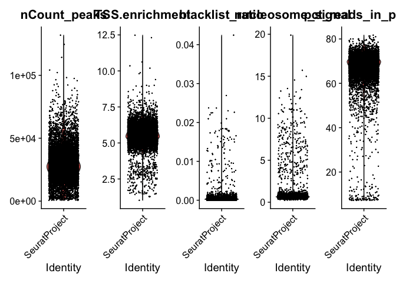
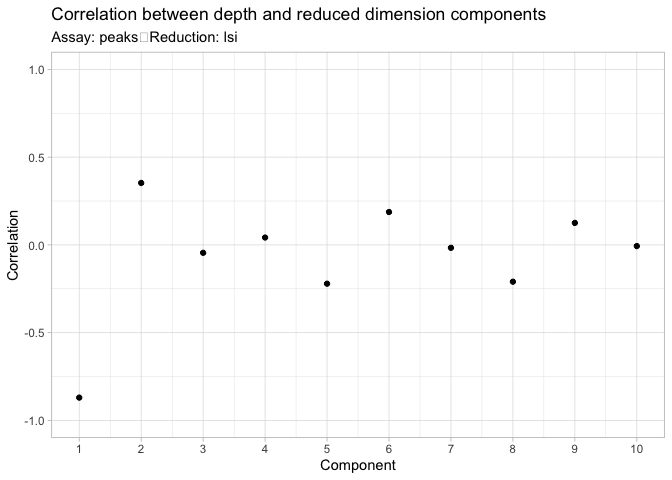
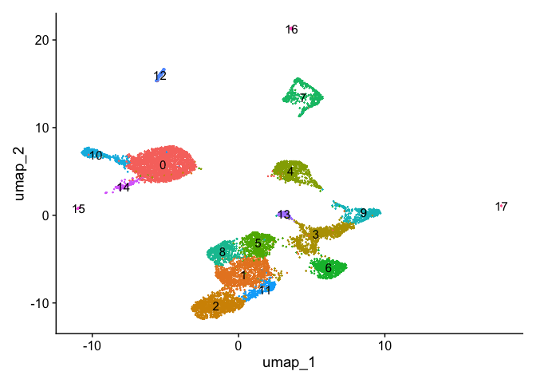
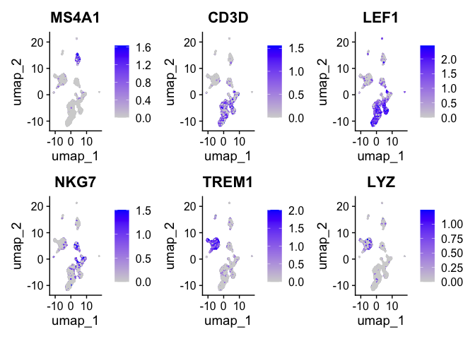
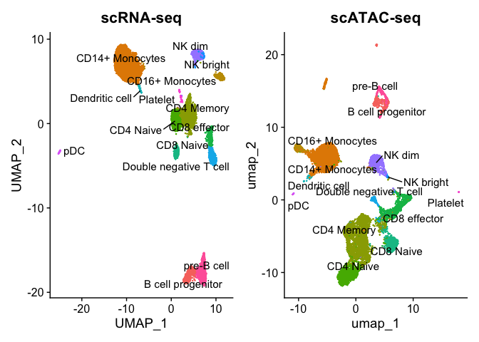
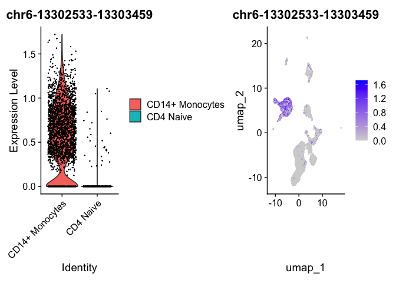
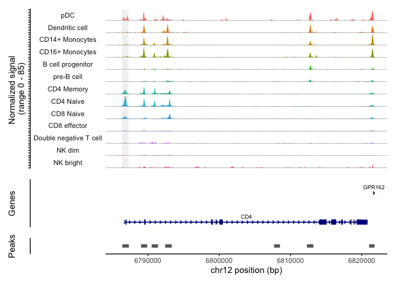
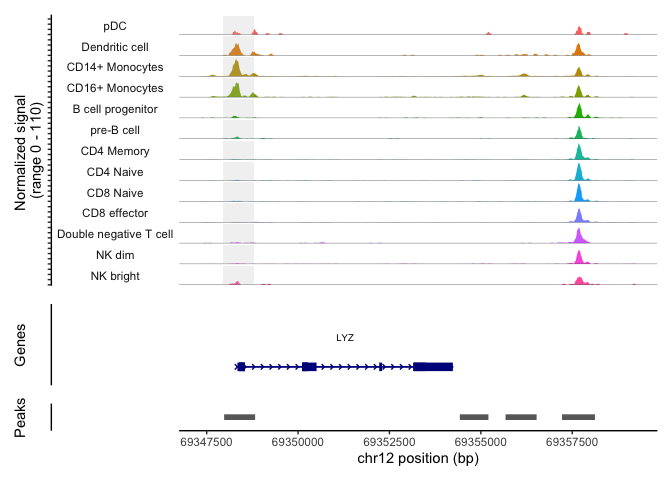

In this tutorial we introduce an standard pipeline of Single Cell ATAC-Seq
analysis. In order to run the steps described below please download the
files from the following 
[link](https://figshare.com/articles/dataset/Single_Cell_RNA_ATAC_Seq_integration/27331188).

In genomics, data integration generally refers to combining different types of biological data to create a more comprehensive understanding of complex biological systems. Integrating multiple data types—such as genomic, transcriptomic, and epigenomic data—allows researchers to capture diverse molecular layers that influence cellular function, uncovering relationships and regulatory mechanisms that might not be evident from a single dataset.

Specifically, in the context of ATAC-seq (chromatin accessibility data) and RNA-seq (transcriptomic data), integration seeks to connect chromatin accessibility (which regions of DNA are open and potentially active) with gene expression (which genes are being transcribed and expressed as mRNA). This integration helps to build a bridge between gene regulation and gene activity.

ATAC- and RNA integration is a useful approach than can be used for addressing: 
(i) the link between Open Chromatin Regions to gene expression, 
(ii) inferring Gene Regulatory Networks interactions 
(iii) performing cell type annotation 
(iv) analyzing dynamical trajectories.


## Pre-processing workflow


### Installations

For the pipeline, we will use the Signac R library. Please, make sure that
you have installed the following libraries by running the following commands.


``` r
install.packages('hdf5r')      ## More instructions about installing 
                                ## https://github.com/hhoeflin/hdf5r
install.packages('ggplot2')
install.packages('patchwork')
install.packages('Seurat')
install.packages('Signac') 

if (!require("BiocManager"))
    install.packages("BiocManager")
BiocManager::install("GenomicRanges")
```


Then, we load the libraries. 


``` r
library(Signac)
library(Seurat)
library(GenomicRanges)
library(ggplot2)
library(patchwork)
library(hdf5r)
```


### Loading data

The input formats for the Signac pipeline might vary. However, there are at 
least to important files which are necessary. 

i) Peaks per cell matrix. Containing the read counts per peak and per cell
as a square matrix. 

ii) Fragment file. A list of all recorded fragment reads including peaks which
are not mapped to peaks. These reads might be necessary for computing some 
QC metrics and further analysis.

Optionally, cell annotations might be also added. 

In the following lines we load the peaks counts matrix, fragment files and 
metadata. In the same way as we did for scRNA-Seq we create a Seurat
object to store the data.


``` r
counts <- Read10X_h5(filename = "/Users/cbg-mbp-02/Documents/data/r2sc2024/10k_pbmc_ATACv2_nextgem_Chromium_Controller_filtered_peak_bc_matrix.h5")
metadata <- read.csv(
  file = "/Users/cbg-mbp-02/Documents/data/r2sc2024/10k_pbmc_ATACv2_nextgem_Chromium_Controller_singlecell.csv",
  header = TRUE,
  row.names = 1
)

chrom_assay <- CreateChromatinAssay(
  counts = counts,
  sep = c(":", "-"),
  fragments = "/Users/cbg-mbp-02/Documents/data/r2sc2024/10k_pbmc_ATACv2_nextgem_Chromium_Controller_fragments.tsv.gz",
  min.cells = 10,
  min.features = 200
)

pbmc <- CreateSeuratObject(
  counts = chrom_assay,
  assay = "peaks",
  meta.data = metadata
)
```

The counts matrix can be accessed in the following path:


``` r
pbmc[['peaks']]$counts[1:5, 1:5]
```

```
## 5 x 5 sparse Matrix of class "dgCMatrix"
##                    AAACGAAAGAGAGGTA-1 AAACGAAAGCAGGAGG-1 AAACGAAAGGAAGAAC-1
## chr1-9772-10660                     .                  .                  .
## chr1-180712-181178                  .                  .                  .
## chr1-181200-181607                  .                  .                  .
## chr1-191183-192084                  .                  .                  .
## chr1-267576-268461                  .                  .                  .
##                    AAACGAAAGTCGACCC-1 AAACGAACAAGCACTT-1
## chr1-9772-10660                     .                  .
## chr1-180712-181178                  .                  .
## chr1-181200-181607                  .                  .
## chr1-191183-192084                  .                  .
## chr1-267576-268461                  .                  .
```


``` r
granges(pbmc)
```

```
## GRanges object with 165434 ranges and 0 metadata columns:
##              seqnames        ranges strand
##                 <Rle>     <IRanges>  <Rle>
##        [1]       chr1    9772-10660      *
##        [2]       chr1 180712-181178      *
##        [3]       chr1 181200-181607      *
##        [4]       chr1 191183-192084      *
##        [5]       chr1 267576-268461      *
##        ...        ...           ...    ...
##   [165430] KI270713.1   13054-13909      *
##   [165431] KI270713.1   15212-15933      *
##   [165432] KI270713.1   21459-22358      *
##   [165433] KI270713.1   29676-30535      *
##   [165434] KI270713.1   36913-37813      *
##   -------
##   seqinfo: 35 sequences from an unspecified genome; no seqlengths
```


``` r
peaks.keep <- seqnames(granges(pbmc)) %in% standardChromosomes(granges(pbmc))
pbmc <- pbmc[as.vector(peaks.keep), ]
```


``` r
library(AnnotationHub)
ah <- AnnotationHub()

# Search for the Ensembl 98 EnsDb for Homo sapiens on AnnotationHub
query(ah, "EnsDb.Hsapiens.v98")
```

```
## AnnotationHub with 1 record
## # snapshotDate(): 2024-04-30
## # names(): AH75011
## # $dataprovider: Ensembl
## # $species: Homo sapiens
## # $rdataclass: EnsDb
## # $rdatadateadded: 2019-05-02
## # $title: Ensembl 98 EnsDb for Homo sapiens
## # $description: Gene and protein annotations for Homo sapiens based on Ensem...
## # $taxonomyid: 9606
## # $genome: GRCh38
## # $sourcetype: ensembl
## # $sourceurl: http://www.ensembl.org
## # $sourcesize: NA
## # $tags: c("98", "AHEnsDbs", "Annotation", "EnsDb", "Ensembl", "Gene",
## #   "Protein", "Transcript") 
## # retrieve record with 'object[["AH75011"]]'
```


``` r
ensdb_v98 <- ah[["AH75011"]]
```


``` r
# extract gene annotations from EnsDb
annotations <- GetGRangesFromEnsDb(ensdb = ensdb_v98)

# change to UCSC style since the data was mapped to hg38
seqlevels(annotations) <- paste0('chr', seqlevels(annotations))
genome(annotations) <- "hg38"
```


``` r
# add the gene information to the object
Annotation(pbmc) <- annotations
```


``` r
# compute nucleosome signal score per cell
pbmc <- NucleosomeSignal(object = pbmc)

# compute TSS enrichment score per cell
pbmc <- TSSEnrichment(object = pbmc)

# add fraction of reads in peaks
pbmc$pct_reads_in_peaks <- pbmc$peak_region_fragments / pbmc$passed_filters * 100

# add blacklist ratio
pbmc$blacklist_ratio <- FractionCountsInRegion(
  object = pbmc, 
  assay = 'peaks',
  regions = blacklist_hg38_unified
)
```


``` r
DensityScatter(pbmc, x = 'nCount_peaks', y = 'TSS.enrichment', log_x = TRUE, quantiles = TRUE)
```




``` r
pbmc$nucleosome_group <- ifelse(pbmc$nucleosome_signal > 4, 'NS > 4', 'NS < 4')
FragmentHistogram(object = pbmc, group.by = 'nucleosome_group')
```




``` r
VlnPlot(
  object = pbmc,
  features = c('nCount_peaks', 'TSS.enrichment', 'blacklist_ratio', 'nucleosome_signal', 'pct_reads_in_peaks'),
  pt.size = 0.1,
  ncol = 5
)
```




``` r
pbmc <- subset(
  x = pbmc,
  subset = nCount_peaks > 9000 &
    nCount_peaks < 100000 &
    pct_reads_in_peaks > 40 &
    blacklist_ratio < 0.01 &
    nucleosome_signal < 4 &
    TSS.enrichment > 4
)
pbmc
```

```
## An object of class Seurat 
## 165376 features across 9651 samples within 1 assay 
## Active assay: peaks (165376 features, 0 variable features)
##  2 layers present: counts, data
```


``` r
pbmc <- RunTFIDF(pbmc)
pbmc <- FindTopFeatures(pbmc, min.cutoff = 'q0')
pbmc <- RunSVD(pbmc)
```


``` r
DepthCor(pbmc)
```




``` r
pbmc <- RunUMAP(object = pbmc, reduction = 'lsi', dims = 2:30)
pbmc <- FindNeighbors(object = pbmc, reduction = 'lsi', dims = 2:30)
pbmc <- FindClusters(object = pbmc, verbose = FALSE, algorithm = 3)
DimPlot(object = pbmc, label = TRUE) + NoLegend()
```




``` r
## This step takes some time to run
gene.activities <- GeneActivity(pbmc)
```


``` r
# add the gene activity matrix to the Seurat object as a new assay and normalize it
pbmc[['RNA']] <- CreateAssayObject(counts = gene.activities)
pbmc <- NormalizeData(
  object = pbmc,
  assay = 'RNA',
  normalization.method = 'LogNormalize',
  scale.factor = median(pbmc$nCount_RNA)
)
```


``` r
DefaultAssay(pbmc) <- 'RNA'

FeaturePlot(
  object = pbmc,
  features = c('MS4A1', 'CD3D', 'LEF1', 'NKG7', 'TREM1', 'LYZ'),
  pt.size = 0.1,
  max.cutoff = 'q95',
  ncol = 3
)
```




``` r
# Load the pre-processed scRNA-seq data for PBMCs
pbmc_rna <- readRDS("/Users/cbg-mbp-02/Documents/data/r2sc2024/pbmc_10k_v3.rds")
pbmc_rna <- UpdateSeuratObject(pbmc_rna)
```


``` r
transfer.anchors <- FindTransferAnchors(
  reference = pbmc_rna,
  query = pbmc,
  reduction = 'cca'
)
```


``` r
predicted.labels <- TransferData(
  anchorset = transfer.anchors,
  refdata = pbmc_rna$celltype,
  weight.reduction = pbmc[['lsi']],
  dims = 2:30
)
```


``` r
pbmc <- AddMetaData(object = pbmc, metadata = predicted.labels)
```


``` r
plot1 <- DimPlot(
  object = pbmc_rna,
  group.by = 'celltype',
  label = TRUE,
  repel = TRUE) + NoLegend() + ggtitle('scRNA-seq')

plot2 <- DimPlot(
  object = pbmc,
  group.by = 'predicted.id',
  label = TRUE,
  repel = TRUE) + NoLegend() + ggtitle('scATAC-seq')

plot1 + plot2
```




``` r
predicted_id_counts <- table(pbmc$predicted.id)

# Identify the predicted.id values that have more than 20 cells
major_predicted_ids <- names(predicted_id_counts[predicted_id_counts > 20])
pbmc <- pbmc[, pbmc$predicted.id %in% major_predicted_ids]
```


``` r
# change cell identities to the per-cell predicted labels
Idents(pbmc) <- pbmc$predicted.id
```


``` r
# change back to working with peaks instead of gene activities
DefaultAssay(pbmc) <- 'peaks'

# wilcox is the default option for test.use
da_peaks <- FindMarkers(
  object = pbmc,
  ident.1 = "CD4 Naive",
  ident.2 = "CD14+ Monocytes",
  test.use = 'wilcox',
  min.pct = 0.1
)

head(da_peaks)
```

```
##                           p_val avg_log2FC pct.1 pct.2 p_val_adj
## chr6-13302533-13303459        0  -5.247815 0.026 0.772         0
## chr19-54207815-54208728       0  -4.384378 0.049 0.793         0
## chr17-78198651-78199583       0  -5.505552 0.024 0.760         0
## chr12-119988511-119989430     0   4.153581 0.782 0.089         0
## chr7-142808530-142809435      0   3.663154 0.758 0.087         0
## chr17-82126458-82127377       0   4.997442 0.704 0.043         0
```


``` r
plot1 <- VlnPlot(
  object = pbmc,
  features = rownames(da_peaks)[1],
  pt.size = 0.1,
  idents = c("CD4 Naive","CD14+ Monocytes")
)
plot2 <- FeaturePlot(
  object = pbmc,
  features = rownames(da_peaks)[1],
  pt.size = 0.1
)

plot1 | plot2
```




``` r
open_cd4naive <- rownames(da_peaks[da_peaks$avg_log2FC > 3, ])
open_cd14mono <- rownames(da_peaks[da_peaks$avg_log2FC < -3, ])

closest_genes_cd4naive <- ClosestFeature(pbmc, regions = open_cd4naive)
closest_genes_cd14mono <- ClosestFeature(pbmc, regions = open_cd14mono)
```


``` r
head(closest_genes_cd4naive)
```

```
##                           tx_id gene_name         gene_id   gene_biotype type
## ENSE00002206071 ENST00000397558    BICDL1 ENSG00000135127 protein_coding exon
## ENST00000632998 ENST00000632998     PRSS2 ENSG00000275896 protein_coding  utr
## ENST00000665763 ENST00000665763    CCDC57 ENSG00000176155 protein_coding  gap
## ENST00000645515 ENST00000645515  ATP6V0A4 ENSG00000105929 protein_coding  cds
## ENST00000545320 ENST00000545320       CD6 ENSG00000013725 protein_coding  gap
## ENST00000603548 ENST00000603548     FBXW7 ENSG00000109670 protein_coding  utr
##                            closest_region              query_region distance
## ENSE00002206071 chr12-119989869-119990297 chr12-119988511-119989430      438
## ENST00000632998  chr7-142774509-142774564  chr7-142808530-142809435    33965
## ENST00000665763   chr17-82101867-82127691   chr17-82126458-82127377        0
## ENST00000645515  chr7-138752625-138752837  chr7-138752283-138753197        0
## ENST00000545320   chr11-60971915-60987907   chr11-60985909-60986801        0
## ENST00000603548  chr4-152320544-152322880  chr4-152100248-152101142   219401
```


``` r
head(closest_genes_cd14mono)
```

```
##                           tx_id gene_name         gene_id   gene_biotype type
## ENST00000606214 ENST00000606214    TBC1D7 ENSG00000145979 protein_coding  gap
## ENST00000448962 ENST00000448962      RPS9 ENSG00000170889 protein_coding  gap
## ENST00000592988 ENST00000592988     AFMID ENSG00000183077 protein_coding  gap
## ENST00000336600 ENST00000336600  C6orf223 ENSG00000181577 protein_coding  utr
## ENSE00002618192 ENST00000569518    VCPKMT ENSG00000100483 protein_coding exon
## ENSE00001389095 ENST00000340607     PTGES ENSG00000148344 protein_coding exon
##                           closest_region             query_region distance
## ENST00000606214   chr6-13267836-13305061   chr6-13302533-13303459        0
## ENST00000448962  chr19-54201610-54231740  chr19-54207815-54208728        0
## ENST00000592988  chr17-78191061-78202498  chr17-78198651-78199583        0
## ENST00000336600   chr6-44003127-44007612   chr6-44058439-44059230    50826
## ENSE00002618192  chr14-50108632-50109713  chr14-50038381-50039286    69345
## ENSE00001389095 chr9-129752887-129753042 chr9-129776928-129777838    23885
```


``` r
pbmc <- SortIdents(pbmc)
```


``` r
# find DA peaks overlapping gene of interest
regions_highlight <- subsetByOverlaps(StringToGRanges(open_cd4naive), LookupGeneCoords(pbmc, "CD4"))

CoveragePlot(
  object = pbmc,
  region = "CD4",
  region.highlight = regions_highlight,
  extend.upstream = 1000,
  extend.downstream = 1000
)
```




``` r
regions_highlight <- subsetByOverlaps(StringToGRanges(open_cd14mono), LookupGeneCoords(pbmc, "LYZ"))

CoveragePlot(
  object = pbmc,
  region = "LYZ",
  region.highlight = regions_highlight,
  extend.upstream = 1000,
  extend.downstream = 5000
)
```




