In this tutorial we introduce an standard pipeline of Single Cell ATAC-Seq
analysis. In order to run the steps described below please download the
files from the following 
[link](https://figshare.com/articles/dataset/Single_Cell_RNA_ATAC_Seq_integration/27331188).

In genomics, data integration generally refers to combining different types of biological data to create a more comprehensive understanding of complex biological systems. Integrating multiple data types—such as genomic, transcriptomic, and epigenomic data—allows researchers to capture diverse molecular layers that influence cellular function, uncovering relationships and regulatory mechanisms that might not be evident from a single dataset.

Specifically, in the context of ATAC-seq (chromatin accessibility data) and RNA-seq (transcriptomic data), integration seeks to connect chromatin accessibility (which regions of DNA are open and potentially active) with gene expression (which genes are being transcribed and expressed as mRNA). This integration helps to build a bridge between gene regulation and gene activity.

ATAC- and RNA integration is a useful approach than can be used for addressing: 
(i) the link between Open Chromatin Regions to gene expression, 
(ii) inferring Gene Regulatory Networks interactions 
(iii) performing cell type annotation 
(iv) analyzing dynamical trajectories.


## Pre-processing workflow


### Installations

For the pipeline, we will use the Signac R library. Please, make sure that
you have installed the following libraries by running the following commands.


``` r
install.packages('hdf5r')      ## More instructions about installing 
                                ## https://github.com/hhoeflin/hdf5r
install.packages('ggplot2')
install.packages('patchwork')
install.packages('Seurat')
install.packages('Signac') 


if (!require("BiocManager"))
    install.packages("BiocManager")
BiocManager::install("GenomicRanges")
BiocManager::install("AnnotationHub")
```


Then, we load the libraries. 


``` r
library(Signac)
library(Seurat)
library(GenomicRanges)
library(ggplot2)
library(patchwork)
library(hdf5r)
library(AnnotationHub)
```


### Loading data

The input formats for the Signac pipeline might vary. However, there are at 
least to important files which are necessary. 

i) Peaks per cell matrix. Containing the read counts per peak and per cell
as a square matrix. 

ii) Fragment file. A list of all recorded fragment reads including peaks which
are not mapped to peaks. These reads might be necessary for computing some 
QC metrics and further analysis.

Optionally, cell annotations might be also added. 

In the following lines we load the peaks counts matrix, fragment files and 
metadata. In the same way as we did for scRNA-Seq we create a Seurat
object to store the data.


``` r
path='/Users/carlherrmann/Dropbox/00_MBP_Carl/Teaching/OtherCourses/oct2024/data/'
counts <- Read10X_h5(file.path(path,'atac_pbmc_1k_nextgem_filtered_peak_bc_matrix.h5'))
metadata <- read.csv(
  file = file.path(path,'atac_pbmc_1k_nextgem_singlecell.csv'),
  header = TRUE,
  row.names = 1
)

chrom_assay <- CreateChromatinAssay(
  counts = counts,
  sep = c(":", "-"),
  fragments = file.path(path,'atac_pbmc_1k_nextgem_fragments.tsv.gz'),
  min.cells = 10,
  min.features = 200
)

pbmc <- CreateSeuratObject(
  counts = chrom_assay,
  assay = "peaks",
  meta.data = metadata
)
```

The counts matrix can be accessed in the following path:


``` r
pbmc[['peaks']]$counts[1:5, 1:5]
```

```
## 5 x 5 sparse Matrix of class "dgCMatrix"
##                    AAACGAATCGCATAAC-1 AAACGAATCTGTGTGA-1 AAACTCGAGAGGAACA-1
## chr1-9767-10657                     .                  .                  .
## chr1-191273-192086                  .                  .                  .
## chr1-267563-268458                  .                  .                  2
## chr1-629540-630395                  .                  .                  .
## chr1-633600-634489                  .                  .                  .
##                    AAACTCGAGCCTGTAT-1 AAACTCGAGCTGAGGT-1
## chr1-9767-10657                     .                  .
## chr1-191273-192086                  .                  .
## chr1-267563-268458                  .                  .
## chr1-629540-630395                  .                  .
## chr1-633600-634489                  .                  .
```


``` r
granges(pbmc)
```

```
## GRanges object with 79973 ranges and 0 metadata columns:
##             seqnames        ranges strand
##                <Rle>     <IRanges>  <Rle>
##       [1]       chr1    9767-10657      *
##       [2]       chr1 191273-192086      *
##       [3]       chr1 267563-268458      *
##       [4]       chr1 629540-630395      *
##       [5]       chr1 633600-634489      *
##       ...        ...           ...    ...
##   [79969] KI270726.1   27104-27985      *
##   [79970] KI270713.1     3938-4823      *
##   [79971] KI270713.1   21364-22265      *
##   [79972] KI270713.1   29610-30522      *
##   [79973] KI270713.1   36938-37826      *
##   -------
##   seqinfo: 34 sequences from an unspecified genome; no seqlengths
```

In the next step we keep only the peaks which are located in conventional 
chromosomes. 


``` r
peaks.keep <- seqnames(granges(pbmc)) %in% standardChromosomes(granges(pbmc))
pbmc <- pbmc[as.vector(peaks.keep), ]
```

Next, we annotate the peaks to genomic regions. The AnnotationHub R library 
provides access to genome databales like ENSEMBL and UCSC resources. 


``` r
ah <- AnnotationHub()

# Search for the Ensembl 98 EnsDb for Homo sapiens on AnnotationHub
query(ah, "EnsDb.Hsapiens.v98")
```

```
## AnnotationHub with 1 record
## # snapshotDate(): 2024-04-30
## # names(): AH75011
## # $dataprovider: Ensembl
## # $species: Homo sapiens
## # $rdataclass: EnsDb
## # $rdatadateadded: 2019-05-02
## # $title: Ensembl 98 EnsDb for Homo sapiens
## # $description: Gene and protein annotations for Homo sapiens based on Ensem...
## # $taxonomyid: 9606
## # $genome: GRCh38
## # $sourcetype: ensembl
## # $sourceurl: http://www.ensembl.org
## # $sourcesize: NA
## # $tags: c("98", "AHEnsDbs", "Annotation", "EnsDb", "Ensembl", "Gene",
## #   "Protein", "Transcript") 
## # retrieve record with 'object[["AH75011"]]'
```

``` r
ensdb_v98 <- ah[["AH75011"]]


# extract gene annotations from EnsDb
annotations <- GetGRangesFromEnsDb(ensdb = ensdb_v98)

# change to UCSC style since the data was mapped to hg38
seqlevels(annotations) <- paste0('chr', seqlevels(annotations))
genome(annotations) <- "hg38"

# add the gene information to the object
Annotation(pbmc) <- annotations
```

## Annotating peaks to genomic regions


``` r
library(ChIPseeker)
library(TxDb.Hsapiens.UCSC.hg38.knownGene)
txdb <- TxDb.Hsapiens.UCSC.hg38.knownGene

peakAnno <- annotatePeak(pbmc@assays$peaks@ranges, 
                         tssRegion=c(-3000, 3000),
                         TxDb=txdb, annoDb="org.Hs.eg.db")
```

```
## >> preparing features information...		 2024-11-11 20:55:12 
## >> identifying nearest features...		 2024-11-11 20:55:13
```

```
## >> calculating distance from peak to TSS...	 2024-11-11 20:55:13 
## >> assigning genomic annotation...		 2024-11-11 20:55:13
```

```
## >> adding gene annotation...			 2024-11-11 20:55:32
```

```
## >> assigning chromosome lengths			 2024-11-11 20:55:32 
## >> done...					 2024-11-11 20:55:32
```

``` r
plotAnnoPie(peakAnno)
```

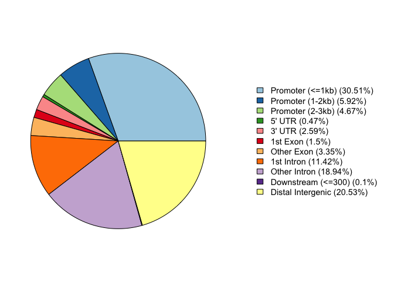

Most peaks are in the promoter region of genes, then in intronic regions and in intergenic regions!


## Quality control

In single-cell ATAC-seq (scATAC-seq) data, quality control is essential to ensure meaningful interpretation of chromatin accessibility at the single-cell level. Several metrics are commonly used to assess data quality. First, the nucleosome banding pattern provides insight into chromatin structure by identifying whether fragments align in characteristic periodic patterns, reflecting nucleosome-bound and nucleosome-free regions. This pattern helps distinguish high-quality cells with well-defined chromatin states. TSS enrichment score measures the accumulation of fragments near transcription start sites (TSS), with high scores indicating open, accessible regions around gene promoters, characteristic of active chromatin. Additionally, the total number of fragments in peaks is evaluated to confirm that sufficient reads fall within identified accessible regions (peaks), a sign of effective enrichment in regulatory regions. Lastly, the ratio of reads in genomic blacklist regions is checked; these blacklist regions are typically artifactual and non-informative, so a low proportion of reads mapping to them suggests cleaner, high-quality data with minimal background noise. 


In the following chunk these QC metrics are calculated.


``` r
# compute nucleosome signal score per cell
pbmc <- NucleosomeSignal(object = pbmc)

# compute TSS enrichment score per cell
pbmc <- TSSEnrichment(object = pbmc)

# add fraction of reads in peaks
pbmc$pct_reads_in_peaks <- pbmc$peak_region_fragments / pbmc$passed_filters * 100

# add blacklist ratio
pbmc$blacklist_ratio <- FractionCountsInRegion(
  object = pbmc, 
  assay = 'peaks',
  regions = blacklist_hg38_unified
)
```

During quality control it is advisable to use jointly use different
QC metrics in order to decide which cells to retain and what to filter.
In the next plot the total number of counts in cells and signal around
TSS are shown as an scatter density plot.


``` r
DensityScatter(pbmc, 
               x = 'nCount_peaks', 
               y = 'TSS.enrichment', 
               log_x = TRUE, 
               quantiles = TRUE)
```

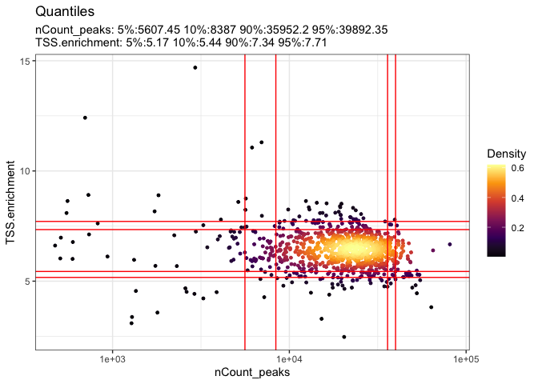


The red lines represent 5, 10, 90 and 95 percentiles. So, for example most of the cells
are in a range of ~ 15k and 45k total reads in peaks (nCount_peaks).


Now, we show a nucleosome band patterning. A healthy good quality ATAC-Seq pattern should show a periodicity like the following one.


``` r
#pbmc$nucleosome_group <- ifelse(pbmc$nucleosome_signal > 4, 'NS > 4', 'NS < 4')
#FragmentHistogram(object = pbmc, group.by = 'nucleosome_group')
FragmentHistogram(object = pbmc, 
                  group.by = "orig.ident")
```

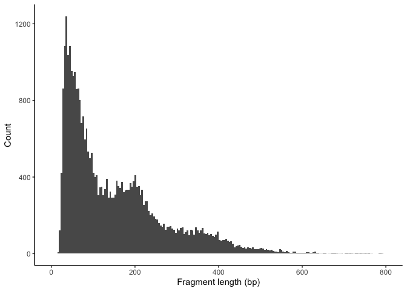


The following violin plots show the separate distributions of the QC metrics. 


``` r
VlnPlot(
  object = pbmc,
  group.by = "orig.ident",
  features = c('nCount_peaks', 'TSS.enrichment', 'blacklist_ratio', 'nucleosome_signal', 'pct_reads_in_peaks'),
  pt.size = 0.1,
  ncol = 5
)
```

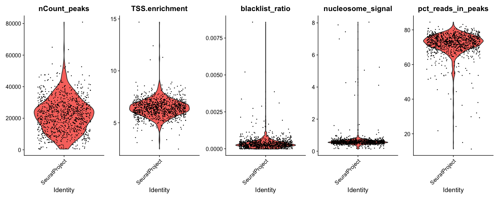

We can use this information to filter in/out cells. Filtering usually requires 
visual inspection in order to set up thresholds. Outliers in the distributions
might represent doublets, empty droplets, dying cells or artefactual barcodes. 


``` r
pbmc <- subset(
  x = pbmc,
  subset = nCount_peaks > 9000 &
    nCount_peaks < 100000 &
    pct_reads_in_peaks > 40 &
    blacklist_ratio < 0.01 &
    nucleosome_signal < 4 &
    TSS.enrichment > 4
)
pbmc
```

```
## An object of class Seurat 
## 79945 features across 878 samples within 1 assay 
## Active assay: peaks (79945 features, 0 variable features)
##  2 layers present: counts, data
```

In the Signac pipeline for scATAC-seq data analysis, RunTFIDF and RunSVD are critical functions used for data normalization and dimensionality reduction. 

RunTFIDF applies a **Term Frequency-Inverse Document Frequency (TF-IDF)** transformation to the cell-by-peak matrix, where each entry reflects how often a particular peak is accessible in a cell, adjusted for how frequently it appears across all cells. This normalization enhances the signal of cell-specific accessibility patterns and reduces the influence of universally accessible regions. Following this, RunSVD (Singular Value Decomposition) reduces the dimensionality of the TF-IDF matrix, extracting key components that capture the variation in chromatin accessibility across cells. This enables clustering and visualization of cells based on chromatin accessibility profiles, facilitating identification of cell types and states within scATAC-seq data.


``` r
pbmc <- RunTFIDF(pbmc)
pbmc <- FindTopFeatures(pbmc, min.cutoff = 'q0')
pbmc <- RunSVD(pbmc)
```

In the process of dimensional reduction, peaks data is transformed into a 
different features/components space (like in Principal Component Analysis PCA). 
In the next plot the correlation between each components of the
dimensional reduction and the sequencing depth. Normally we avoid to drive
any conclusion based in features correlated to the sequencing process since
this might be just an artefactual and for that reason we remove this effect
in the visualization step by removing this dimensions.


``` r
DepthCor(pbmc)
```

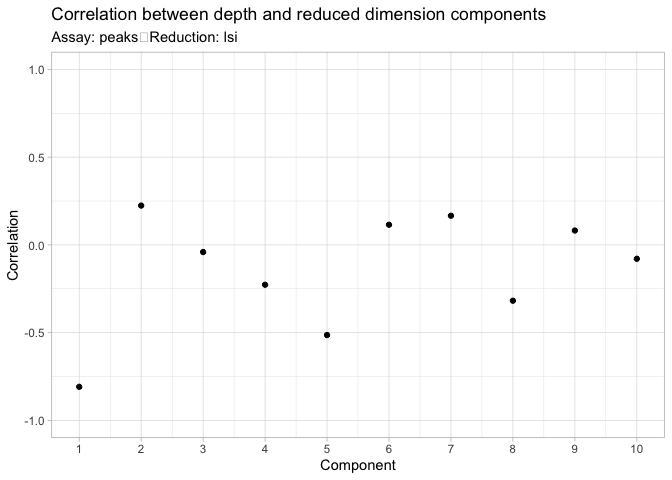


As in the Gene Expression data we can project our data now in two dimensions
in order to visualize the cells. The next


``` r
pbmc <- RunUMAP(object = pbmc, reduction = 'lsi', dims = 2:30)
pbmc <- FindNeighbors(object = pbmc, reduction = 'lsi', dims = 2:30)
pbmc <- FindClusters(object = pbmc, graph.name ='peaks_snn',verbose = FALSE, algorithm = 3)
DimPlot(object = pbmc, label = TRUE) + NoLegend()
```

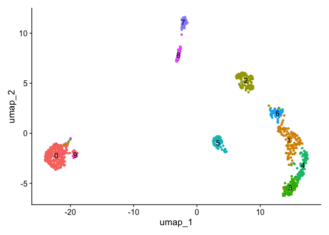


## Gene Activity Analysis


In scATAC-seq analysis, gene activity analysis aims to infer gene expression potential from chromatin accessibility data, providing a proxy for transcriptional activity in the absence of direct RNA measurements. Since scATAC-seq profiles accessible regulatory regions, we can estimate the activity of genes by measuring the accessibility of their promoters and nearby regulatory elements, such as enhancers. This is often achieved by aggregating accessibility counts from peaks located within or near a gene body, typically within a defined distance from the transcription start site (TSS). These aggregated signals can be used to build a "gene activity matrix," which resembles an expression matrix in scRNA-seq data and enables comparative analysis. Gene activity analysis is especially valuable in multi-modal or integration workflows, as it allows researchers to connect chromatin accessibility profiles to transcriptional states, facilitating cell type annotation and regulatory network inference in single-cell studies.

The following function calculates gene activities.


``` r
## This step takes some time to run
gene.activities <- GeneActivity(pbmc)
```

The following step performs a normalization of the calculated gene activities.


``` r
# add the gene activity matrix to the Seurat object as a new assay and normalize it
pbmc[['RNA']] <- CreateAssayObject(counts = gene.activities)
pbmc <- NormalizeData(
  object = pbmc,
  assay = 'RNA',
  normalization.method = 'LogNormalize',
  scale.factor = median(pbmc$nCount_RNA)
)
```

Then, we can visualize specific gene activity in clusters by inspecting
the UMAP projection.


``` r
DefaultAssay(pbmc) <- 'RNA'

FeaturePlot(
  object = pbmc,
  features = c('MS4A1', 'CD3D', 'LEF1', 'NKG7', 'TREM1', 'LYZ'),
  pt.size = 0.1,
  max.cutoff = 'q95',
  ncol = 3
)
```

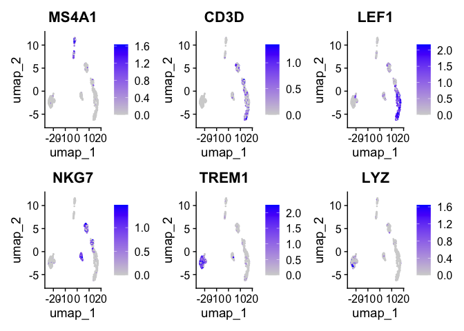

## Label transfer from RNA to ATAC


Since scRNA-seq captures gene expression and scATAC-seq captures regulatory region 
accessibility, label transfer leverages the shared biological information between 
the two modalities. This is typically achieved by first clustering the scRNA-seq data 
(the reference) and assigning cell-type labels based on expression profiles. Then, a 
correspondence is established between the RNA and ATAC data by integrating both datasets 
in a shared low-dimensional space, often using anchor-based methods or common latent spaces.
The scRNA-seq labels can then be transferred to the scATAC-seq cells based on their 
proximity to scRNA-seq cells in this space. This approach enables researchers to 
annotate cell types in scATAC-seq data even in the absence of direct transcriptional 
information, improving the interpretation of chromatin accessibility landscapes 
and supporting integrative analyses across modalities.

First, we load the reference scRNA-Seq dataset, that we previously worked with.


``` r
# Load the pre-processed scRNA-seq data for PBMCs
pbmc_rna <- readRDS("/Users/carlherrmann/Downloads/pbmc_1k_v3.rds")
pbmc_rna <- UpdateSeuratObject(pbmc_rna)
```

Using the shared low-dimensional space, algorithms (such as those in Seurat) identify anchors by matching cells in the scRNA-seq dataset to similar cells in the scATAC-seq dataset. Anchors are defined based on the similarity of cell profiles and are typically selected using nearest-neighbor or mutual nearest neighbor (MNN) methods, ensuring each anchor reflects genuine similarity rather than noise.


``` r
transfer.anchors <- FindTransferAnchors(
  reference = pbmc_rna,
  query = pbmc,
  reduction = 'cca'
)
```

Once anchors are established, cell-type labels from the scRNA-seq dataset can be transferred to the scATAC-seq cells based on anchor assignments. Cells that share an anchor are likely to represent the same cell type or state, enabling accurate annotation of cell types in scATAC-seq data.


``` r
predicted.labels <- TransferData(
  anchorset = transfer.anchors,
  refdata = pbmc_rna$celltype,
  weight.reduction = pbmc[['lsi']],
  dims = 2:30
)

pbmc <- AddMetaData(object = pbmc, metadata = predicted.labels)
```


``` r
plot1 <- DimPlot(
  object = pbmc_rna,
  group.by = 'celltype',
  label = TRUE,
  repel = TRUE) + NoLegend() + ggtitle('scRNA-seq')

plot2 <- DimPlot(
  object = pbmc,
  group.by = 'predicted.id',
  label = TRUE,
  repel = TRUE) + NoLegend() + ggtitle('scATAC-seq')

plot1 + plot2
```

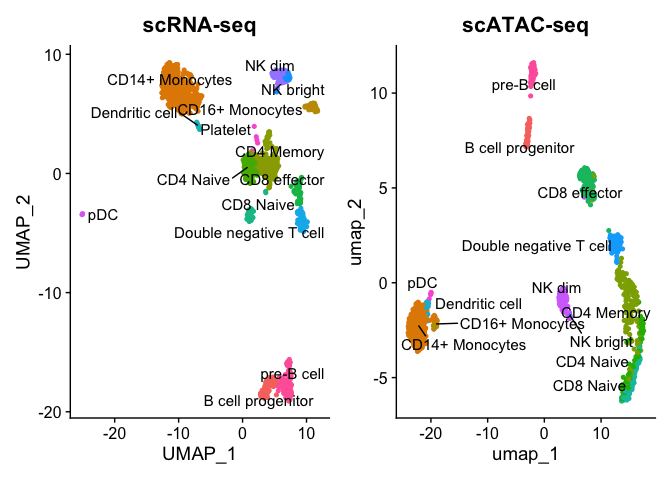

## Identification of cell type chromosomic features

First, we filter out under-represented cell types since is difficult 
to state valid conclusions based in few cells.


``` r
predicted_id_counts <- table(pbmc$predicted.id)

# Identify the predicted.id values that have more than 20 cells
major_predicted_ids <- names(predicted_id_counts[predicted_id_counts > 20])
pbmc <- pbmc[, pbmc$predicted.id %in% major_predicted_ids]
```


In the following step the function FindMarkers() is employed to identify 
differentially accessible peaks between two specified cell types: CD4 Naive 
and CD14+ Monocytes. The Wilcoxon test is set as the default statistical method 
for comparing the accessibility profiles of these two cell types, and a minimum 
percentage threshold of 0.1 is applied to ensure that only peaks present in at least 
10% of the cells in either group are considered. Finally, the results of the 
differential accessibility analysis are displayed using the head function, 
which shows the top entries of the resulting data frame da_peaks.


``` r
# change cell identities to the per-cell predicted labels
Idents(pbmc) <- pbmc$predicted.id

# change back to working with peaks instead of gene activities
DefaultAssay(pbmc) <- 'peaks'

# wilcox is the default option for test.use
da_peaks <- FindMarkers(
  object = pbmc,
  ident.1 = "CD4 Naive",
  ident.2 = "CD14+ Monocytes",
  test.use = 'wilcox',
  min.pct = 0.1
)

head(da_peaks)
```

```
##                                  p_val avg_log2FC pct.1 pct.2    p_val_adj
## chr1-59814285-59815204    9.788138e-50   7.071777 0.787 0.008 7.825127e-45
## chr12-119988529-119989427 6.356302e-46   4.481727 0.838 0.046 5.081546e-41
## chr17-82126437-82127355   4.846764e-45  12.813766 0.700 0.000 3.874746e-40
## chr7-142808582-142809442  3.497653e-43   7.909902 0.688 0.004 2.796199e-38
## chr19-49500586-49501460   1.795631e-41   5.281571 0.725 0.025 1.435517e-36
## chr6-96924166-96925086    8.178543e-41   3.786530 0.838 0.080 6.538336e-36
```

Now we can visualize cell type specific peaks as follows.


``` r
plot1 <- VlnPlot(
  object = pbmc,
  features = rownames(da_peaks)[1],
  pt.size = 0.1,
  idents = c("CD4 Naive","CD14+ Monocytes")
)
plot2 <- FeaturePlot(
  object = pbmc,
  features = rownames(da_peaks)[1],
  pt.size = 0.1
)

plot1 | plot2
```

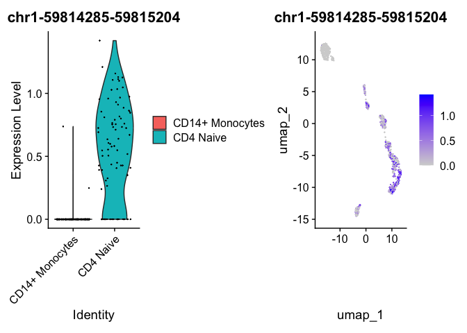


## Interpreting identified peaks

In order to drive conclusions about the identified cell type specific open peaks
it's very useful to identify which genomic locations are closed to that
positions. The `ClosestFeature` is used to annotate peaks to closest annotated
features in chromosome references.


``` r
open_cd4naive <- rownames(da_peaks[da_peaks$avg_log2FC > 3, ])
open_cd14mono <- rownames(da_peaks[da_peaks$avg_log2FC < -3, ])

closest_genes_cd4naive <- ClosestFeature(pbmc, regions = open_cd4naive)
closest_genes_cd14mono <- ClosestFeature(pbmc, regions = open_cd14mono)
```


``` r
head(closest_genes_cd4naive)
```

```
##                           tx_id gene_name         gene_id   gene_biotype type
## ENST00000455990 ENST00000455990     HOOK1 ENSG00000134709 protein_coding  cds
## ENSE00002206071 ENST00000397558    BICDL1 ENSG00000135127 protein_coding exon
## ENST00000665763 ENST00000665763    CCDC57 ENSG00000176155 protein_coding  gap
## ENST00000632998 ENST00000632998     PRSS2 ENSG00000275896 protein_coding  utr
## ENST00000270625 ENST00000270625     RPS11 ENSG00000142534 protein_coding  utr
## ENST00000544166 ENST00000544166    KLHL32 ENSG00000186231 protein_coding  utr
##                            closest_region              query_region distance
## ENST00000455990    chr1-59815118-59815180    chr1-59814285-59815204        0
## ENSE00002206071 chr12-119989869-119990297 chr12-119988529-119989427      441
## ENST00000665763   chr17-82101867-82127691   chr17-82126437-82127355        0
## ENST00000632998  chr7-142774509-142774564  chr7-142808582-142809442    34017
## ENST00000270625   chr19-49499636-49499708   chr19-49500586-49501460      877
## ENST00000544166    chr6-96924620-96925026    chr6-96924166-96925086        0
```


``` r
head(closest_genes_cd14mono)
```

```
##                           tx_id gene_name         gene_id   gene_biotype type
## ENSE00001389095 ENST00000340607     PTGES ENSG00000148344 protein_coding exon
## ENST00000554237 ENST00000554237     VASH1 ENSG00000071246 protein_coding  gap
## ENST00000606214 ENST00000606214    TBC1D7 ENSG00000145979 protein_coding  gap
## ENST00000336600 ENST00000336600  C6orf223 ENSG00000181577 protein_coding  utr
## ENST00000610832 ENST00000610832      KLF4 ENSG00000136826 protein_coding  utr
## ENST00000303004 ENST00000303004     CEBPB ENSG00000172216 protein_coding  utr
##                           closest_region             query_region distance
## ENSE00001389095 chr9-129752887-129753042 chr9-129776921-129777829    23878
## ENST00000554237  chr14-76763131-76769962  chr14-76768047-76768963        0
## ENST00000606214   chr6-13267836-13305061   chr6-13302519-13303438        0
## ENST00000336600   chr6-44003127-44007612   chr6-44058502-44059239    50889
## ENST00000610832 chr9-107489168-107489766 chr9-107489471-107490352        0
## ENST00000303004  chr20-50192072-50192668  chr20-50274659-50275584    81990
```


## Visualization of peaks

For peaks visualization we can use built-in function like `CoveragePlot`.
This function generates coverage plots that display the number of fragments 
(or reads) mapped to specified peaks or genomic features, such as promoters 
or enhancers, in individual cells or aggregated across a group of cells. 
By providing a graphical representation of the accessibility landscape, 
CoveragePlot helps identify patterns of chromatin accessibility that may 
correlate with gene activity or regulatory mechanisms. 
The function can also highlight differences in accessibility between different 
cell types or conditions, making it a valuable tool for interpreting the 
functional significance of chromatin dynamics in single-cell ATAC-seq analyses. 
Additionally, users can customize the plot to focus on specific genes or genomic 
regions of interest, facilitating a targeted exploration of the data.

Here, we visualize a peak identified to be open in CD4 Naive T cells. The peak
is located by looking at a gene and annotated peaks to it. Here, we use the
CD4 gene. 


``` r
## Sorting samples by similarity
pbmc <- SortIdents(pbmc)

# find DA peaks overlapping gene of interest
regions_highlight <- subsetByOverlaps(StringToGRanges(open_cd4naive), 
                                      LookupGeneCoords(pbmc, "CD4"))

CoveragePlot(
  object = pbmc,
  region = "CD4",
  region.highlight = regions_highlight,
  extend.upstream = 1000,
  extend.downstream = 1000
)
```

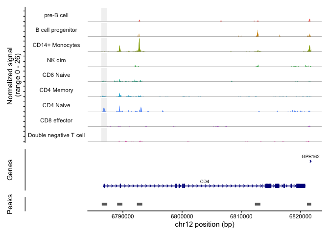

It's interesting to play with the parameters for plotting. We can zoom in/out
chromosomic regions by extending bases up/downstream to the selected


``` r
# find DA peaks overlapping gene of interest
regions_highlight <- subsetByOverlaps(StringToGRanges(open_cd4naive), 
                                      LookupGeneCoords(pbmc, "CD4"))

CoveragePlot(
  object = pbmc,
  region = "CD4",
  region.highlight = regions_highlight,
  extend.upstream = 50000,
  extend.downstream = 50000
)
```

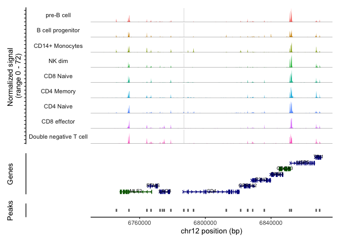


