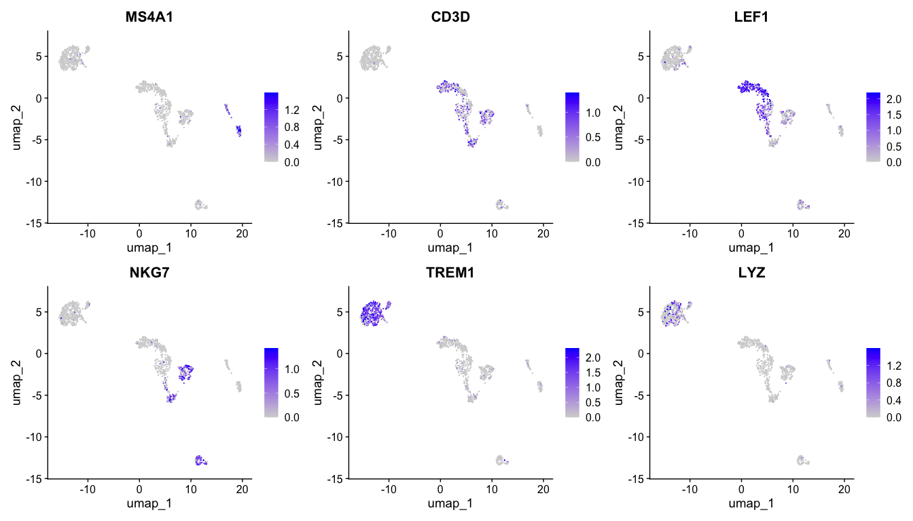
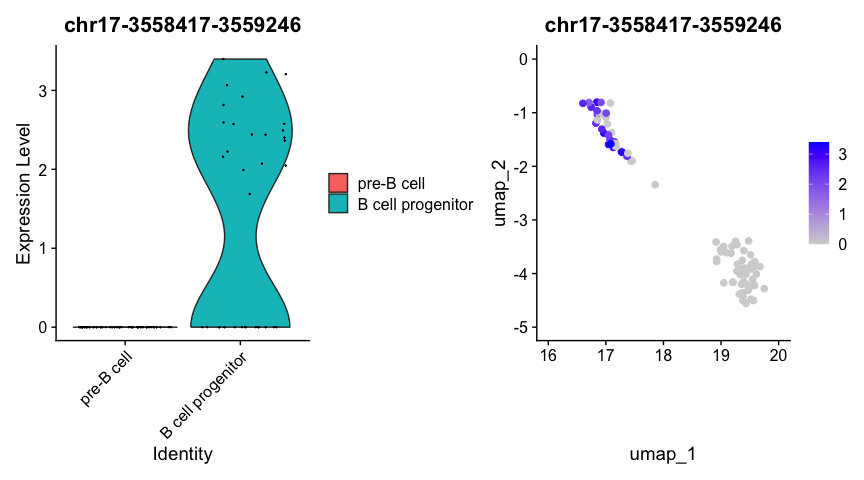
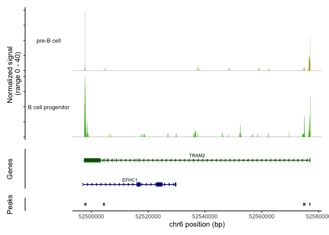

In this section we start using the PBMC data already preprocessed from the last 
section. Please, make sure not to skip any step.


# Integration scRNA-seq/scATAC-seq


## Gene Activity Analysis


In scATAC-seq analysis, gene activity analysis aims to infer gene expression potential from chromatin accessibility data, providing a proxy for transcriptional activity in the absence of direct RNA measurements. Since scATAC-seq profiles accessible regulatory regions, we can estimate the activity of genes by measuring the accessibility of their promoters and nearby regulatory elements, such as enhancers. This is often achieved by aggregating accessibility counts from peaks located within or near a gene body, typically within a defined distance from the transcription start site (TSS). These aggregated signals can be used to build a "gene activity matrix," which resembles an expression matrix in scRNA-seq data and enables comparative analysis. Gene activity analysis is especially valuable in multi-modal or integration workflows, as it allows researchers to connect chromatin accessibility profiles to transcriptional states, facilitating cell type annotation and regulatory network inference in single-cell studies.

The following function calculates gene activities.


``` r
## This step takes some time to run
gene.activities <- GeneActivity(pbmc)
```

The following step performs a normalization of the calculated gene activities.


``` r
# add the gene activity matrix to the Seurat object as a new assay and normalize it
pbmc[['RNA']] <- CreateAssayObject(counts = gene.activities)
pbmc <- NormalizeData(
  object = pbmc,
  assay = 'RNA',
  normalization.method = 'LogNormalize',
  scale.factor = median(pbmc$nCount_RNA)
)
```

Then, we can visualize specific gene activity in clusters by inspecting
the UMAP projection.


``` r
DefaultAssay(pbmc) <- 'RNA'

FeaturePlot(
  object = pbmc,
  features = c('MS4A1', 'CD3D', 'LEF1', 'NKG7', 'TREM1', 'LYZ'),
  pt.size = 0.1,
  max.cutoff = 'q95',
  ncol = 3
)
```



## Label transfer from RNA to ATAC


Since scRNA-seq captures gene expression and scATAC-seq captures regulatory region 
accessibility, label transfer leverages the shared biological information between 
the two modalities. This is typically achieved by first clustering the scRNA-seq data 
(the reference) and assigning cell-type labels based on expression profiles. Then, a 
correspondence is established between the RNA and ATAC data by integrating both datasets 
in a shared low-dimensional space, often using anchor-based methods or common latent spaces.
The scRNA-seq labels can then be transferred to the scATAC-seq cells based on their 
proximity to scRNA-seq cells in this space. This approach enables researchers to 
annotate cell types in scATAC-seq data even in the absence of direct transcriptional 
information, improving the interpretation of chromatin accessibility landscapes 
and supporting integrative analyses across modalities.

First, we load the reference scRNA-Seq dataset, that we previously worked with.


``` r
# Load the pre-processed scRNA-seq data for PBMCs
pbmc_rna <- readRDS("/Users/cbg-mbp-02/Documents/data/r2sc2024/pbmc_10k_v3.rds")
pbmc_rna <- UpdateSeuratObject(pbmc_rna)
```

Using the shared low-dimensional space, algorithms (such as those in Seurat) identify anchors by matching cells in the scRNA-seq dataset to similar cells in the scATAC-seq dataset. Anchors are defined based on the similarity of cell profiles and are typically selected using nearest-neighbor or mutual nearest neighbor (MNN) methods, ensuring each anchor reflects genuine similarity rather than noise.


``` r
transfer.anchors <- FindTransferAnchors(
  reference = pbmc_rna,
  query = pbmc,
  reduction = 'cca'
)
```

Once anchors are established, cell-type labels from the scRNA-seq dataset can be transferred to the scATAC-seq cells based on anchor assignments. Cells that share an anchor are likely to represent the same cell type or state, enabling accurate annotation of cell types in scATAC-seq data.


``` r
predicted.labels <- TransferData(
  anchorset = transfer.anchors,
  refdata = pbmc_rna$celltype,
  weight.reduction = pbmc[['lsi']],
  dims = 2:30
)

pbmc <- AddMetaData(object = pbmc, metadata = predicted.labels)
```


``` r
plot1 <- DimPlot(
  object = pbmc_rna,
  group.by = 'celltype',
  label = TRUE,
  repel = TRUE) + NoLegend() + ggtitle('scRNA-seq')

plot2 <- DimPlot(
  object = pbmc,
  group.by = 'predicted.id',
  label = TRUE,
  repel = TRUE) + NoLegend() + ggtitle('scATAC-seq')

plot1 + plot2
```


## Identification of cell type chromosomic features

First, we filter out under-represented cell types since is difficult 
to state valid conclusions based in few cells.


``` r
predicted_id_counts <- table(pbmc$predicted.id)

# Identify the predicted.id values that have more than 20 cells
major_predicted_ids <- names(predicted_id_counts[predicted_id_counts > 20])
pbmc <- pbmc[, pbmc$predicted.id %in% major_predicted_ids]
```


In the following step the function FindMarkers() is employed to identify 
differentially accessible peaks between two specified cell types: CD4 Naive 
and CD14+ Monocytes. The Wilcoxon test is set as the default statistical method 
for comparing the accessibility profiles of these two cell types, and a minimum 
percentage threshold of 0.1 is applied to ensure that only peaks present in at least 
10% of the cells in either group are considered. Finally, the results of the 
differential accessibility analysis are displayed using the head function, 
which shows the top entries of the resulting data frame da_peaks.


``` r
# change cell identities to the per-cell predicted labels
Idents(pbmc) <- pbmc$predicted.id

# change back to working with peaks instead of gene activities
DefaultAssay(pbmc) <- 'peaks'

## Setting cell types to compare
cell_type_1 <- "B cell progenitor"
#cell_type_1 <- "pDC"
cell_type_2 <- "pre-B cell"

# wilcox is the default option for test.use
da_peaks <- FindMarkers(
  object = pbmc,
  ident.1 = cell_type_1,
  ident.2 = cell_type_2,
  test.use = 'wilcox',
  min.pct = 0.1
)

tail(da_peaks)
```

```
##                           p_val avg_log2FC pct.1 pct.2 p_val_adj
## chr1-208245107-208245847      1  0.2244174 0.114 0.118         1
## chr10-101835715-101836606     1  0.1896736 0.114 0.118         1
## chr12-132904475-132905376     1  0.1616110 0.114 0.118         1
## chr19-46613876-46614775       1  0.1402740 0.114 0.118         1
## chr8-94904992-94905967        1  0.1656689 0.114 0.118         1
## chr19-14073184-14074084       1 -0.1317303 0.257 0.255         1
```

Now we can visualize cell type specific peaks as follows.


``` r
plot1 <- VlnPlot(
  object = pbmc,
  features = rownames(da_peaks)[1],
  pt.size = 0.1,
  idents = c(cell_type_1, cell_type_2)
)
plot2 <- FeaturePlot(
  object = subset(pbmc,
                  predicted.id %in% c(cell_type_1, cell_type_2)
                  ),
  features = rownames(da_peaks)[1],
  pt.size = 2
)

plot1 | plot2
```




## Interpreting identified peaks

In order to drive conclusions about the identified cell type specific open peaks
it's very useful to identify which genomic locations are closed to that
positions. The `ClosestFeature` is used to annotate peaks to closest annotated
features in chromosome references.


``` r
open_cell_type_1 <- rownames(da_peaks[da_peaks$avg_log2FC > 3, ])
open_cell_type_2 <- rownames(da_peaks[da_peaks$avg_log2FC < -3, ])

closest_genes_cell_type_1 <- ClosestFeature(pbmc, regions = open_cell_type_1)
closest_genes_cell_type_2 <- ClosestFeature(pbmc, regions = open_cell_type_2)
```


``` r
head(closest_genes_cell_type_1)
```

```
##                           tx_id gene_name         gene_id   gene_biotype type
## ENSE00001239301 ENST00000576742     TRPV3 ENSG00000167723 protein_coding exon
## ENST00000524347 ENST00000524347      SGCD ENSG00000170624 protein_coding  gap
## ENST00000672146 ENST00000672146     OPRL1 ENSG00000125510 protein_coding  utr
## ENST00000270162 ENST00000270162      SIK1 ENSG00000142178 protein_coding  utr
## ENSE00000674098 ENST00000056233    NFE2L3 ENSG00000050344 protein_coding exon
## ENSE00001811909 ENST00000391984    CAPN10 ENSG00000142330 protein_coding exon
##                           closest_region             query_region distance
## ENSE00001239301    chr17-3557676-3557995    chr17-3558417-3559246      421
## ENST00000524347 chr5-156393866-156508600 chr5-156402205-156403126        0
## ENST00000672146  chr20-64098887-64100633  chr20-64099915-64100843        0
## ENST00000270162  chr21-43414483-43416741  chr21-43352428-43353343    61139
## ENSE00000674098   chr7-26152198-26153068   chr7-25968069-25968997   183200
## ENSE00001811909 chr2-240586734-240587052 chr2-240584285-240585390     1343
```


``` r
head(closest_genes_cell_type_2)
```

```
##                           tx_id gene_name         gene_id   gene_biotype type
## ENST00000340722 ENST00000340722     TCL1B ENSG00000213231 protein_coding  utr
## ENST00000652626 ENST00000652626   GUCY1B1 ENSG00000061918 protein_coding  cds
## ENSE00003713479 ENST00000517566      OXR1 ENSG00000164830 protein_coding exon
## ENST00000395153 ENST00000395153     DACT1 ENSG00000165617 protein_coding  cds
## ENSE00003630226 ENST00000603223     GFOD1 ENSG00000145990 protein_coding exon
## ENST00000358024 ENST00000358024     TMCC2 ENSG00000133069 protein_coding  utr
##                           closest_region             query_region distance
## ENST00000340722  chr14-95691931-95692628  chr14-95695641-95696543     3012
## ENST00000652626 chr4-155759141-155759143 chr4-155758521-155759415        0
## ENSE00003713479 chr8-106359476-106359636 chr8-106269756-106270665    88810
## ENST00000395153  chr14-58638203-58638547  chr14-58637398-58638262        0
## ENSE00003630226   chr6-13486638-13487662   chr6-13526432-13527329    38769
## ENST00000358024 chr1-205227946-205228564 chr1-205227422-205228317        0
```


## Visualization of peaks

For peaks visualization we can use built-in function like `CoveragePlot`.
This function generates coverage plots that display the number of fragments 
(or reads) mapped to specified peaks or genomic features, such as promoters 
or enhancers, in individual cells or aggregated across a group of cells. 
By providing a graphical representation of the accessibility landscape, 
CoveragePlot helps identify patterns of chromatin accessibility that may 
correlate with gene activity or regulatory mechanisms. 
The function can also highlight differences in accessibility between different 
cell types or conditions, making it a valuable tool for interpreting the 
functional significance of chromatin dynamics in single-cell ATAC-seq analyses. 
Additionally, users can customize the plot to focus on specific genes or genomic 
regions of interest, facilitating a targeted exploration of the data.

Here, we visualize a peak identified to be open in CD4 Naive T cells. The peak
is located by looking at a gene and annotated peaks to it. Here, we use the
CD4 gene. 


``` r
## Sorting samples by similarity
pbmc <- SortIdents(pbmc)

# find DA peaks overlapping gene of interest
regions_highlight <- subsetByOverlaps(StringToGRanges(open_cell_type_1), 
                                      LookupGeneCoords(pbmc, "TRAM2"))

CoveragePlot(
  object = pbmc,
  region = "TRAM2",
  region.highlight = regions_highlight,
  extend.upstream = 100,
  extend.downstream = 100, 
  idents = c(cell_type_1, cell_type_2),
)
```



It's interesting to play with the parameters for plotting. We can zoom in/out
chromosomic regions by extending bases up/downstream to the selected.


**QUIZ 1**

<br>

<details>
<summary> How many peaks are differentially open the previous
comparison.
TIP: Check at the dimensions of the table of differential peaks
after taking the statistically significant peaks.
</summary>

<b>Answer:</b>
<br>
<tt> There are 14 differentially open and statistically significant peaks.
You can check this by running.
``` 
da_peaks %>% dplyr::filter(p_val_adj<0.05)
```
</tt>
<br>
</details> 

<br>


**QUIZ 2**

<br>

<details>
<summary> Check the same comparing now pre-B and pDC cell types.
TIP: Re-run the Differential peak analysis.
</summary>

<b>Answer:</b>
<br>
<tt> There are 428 differentially open and statistically significant peaks.
You can check this by running.

``` 
da_peaks %>% dplyr::filter(p_val_adj<0.05)
```

<br>

Is this expected? Try visualizing some differential peak in a coverage
plot as before for those cell types.

</tt>
<br>
</details> 

<br>


