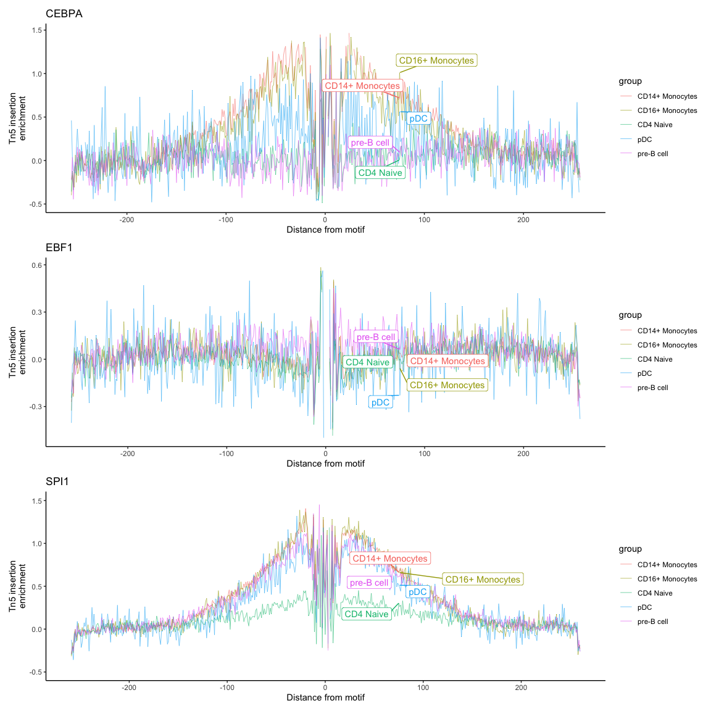

# Motif analysis and footprinting


 In single-cell ATAC-seq (scATAC-seq) footprinting analysis, the goal is to achieve fine-grained identification of transcription factor (TF) binding sites at the single-cell level. In ATAC-seq, footprinting analysis leverages the fact that TFs bound to DNA protect the underlying sequence from transposase insertion, creating “footprints” or regions with fewer fragments. These footprints help pinpoint active regulatory elements and offer insights into TF binding activity in specific cell types or states.

Using Signac, an R package for single-cell chromatin data, scATAC-seq footprinting can be combined with clustering and motif enrichment analyses to map out how chromatin accessibility changes in relation to TF binding across individual cells. This approach is highly valuable for identifying TF regulatory networks, understanding cell identity, and exploring the mechanisms behind cellular differentiation and response. Signac’s streamlined functions make it possible to visualize these footprints and link them to TF motifs, ultimately revealing how specific TFs contribute to gene regulation in various cellular contexts.


``` r
library(Signac)
library(Seurat)
library(GenomicRanges)
library(ggplot2)
library(patchwork)
library(hdf5r)
library(AnnotationHub)
library(motifmatchr)
library(JASPAR2020)
library(TFBSTools)
library(BSgenome.Hsapiens.UCSC.hg38)
```


## Loading motifs information

First we use the function `getMatrixSet()` to retireve motifs from the JASPAR database, which are collections of transcription factor (TF) binding motifs. In the context of single-cell ATAC-seq, these motifs represent sequence patterns that TFs typically recognize and bind to in the genome.
getMatrixSet() is often used in combination with JASPAR2020 or other motif libraries, allowing you to pull a set of motifs for specific TFs or a group of TFs, based on various parameters such as species or collection type.

Then we add motif information to the Seurat object in Signac by associating the retrieved motif matrices (like those from getMatrixSet()) with accessible chromatin regions in the single-cell ATAC-seq dataset.
Using motifmatchr under the hood, it scans these regions for sequence matches to the motifs, effectively identifying where specific TFs may bind in the genome. This information is essential for downstream motif enrichment and footprinting analyses, as it lets you explore how TF binding sites are distributed across different clusters or conditions.


``` r
# extract position frequency matrices for the motifs
pwm <- getMatrixSet(
  x = JASPAR2020,
  opts = list(species = 9606, all_versions = FALSE)
)

# add motif information
pbmc <- AddMotifs(pbmc, genome = BSgenome.Hsapiens.UCSC.hg38, pfm = pwm)
```


## Performing Footprint


A footprint Analysis Workflow in ATAC-Seq performs the following steps: (i) Motif Matching: 
Known TF binding motifs are mapped onto the peaks to predict where each TF could theoretically bind based on sequence patterns. (ii) Footprint Detection: For each motif-matched region, the read coverage is examined closely to detect a footprint pattern (low coverage within the motif, with higher coverage flanking it). This pattern is taken as a sign of TF binding. And (iii) Aggregation and Scoring: To
enhance signal detection, footprints are often aggregated across many cells and regions, allowing for more robust detection. Various scoring metrics are then applied to rank the likelihood of TF binding.


In a TN5 insertion enrichment vs. distance from motif plot, the goal is to visualize how transposase activity is influenced by transcription factor (TF) binding near a motif site, which helps reveal footprint patterns in ATAC-seq data. ATAC-seq uses the TN5 transposase enzyme to cut open regions of chromatin and insert sequencing adapters. This insertion activity provides a proxy for chromatin accessibility.
The following footprint plot can be used to evaluate
when a TF binds to a motif in DNA, it blocks TN5 insertion at the motif’s exact site while leaving adjacent regions accessible. This creates a pattern in the sequencing data: lower insertion frequencies (coverage dips) at the motif site with higher insertion frequencies just outside this region.


``` r
# gather the footprinting information for sets of motifs
pbmc <- Footprint(
  object = pbmc,
  motif.name = c("CEBPA", "EBF1", "SPI1"),
  genome = BSgenome.Hsapiens.UCSC.hg38
)


# plot the footprint data for each group of cells
p2 <- PlotFootprint(pbmc, 
                    features = c("CEBPA", "EBF1", "SPI1"), 
                    group.by = "predicted.id", 
                    show.expected = FALSE, 
                    repel = TRUE, 
                    idents = c("pre-B cell",
                               "CD14+ Monocytes",
                               "CD16+ Monocytes",
                               "pDC",
                               "CD4 Naive"), 
                    label.top = 5)
p2 + patchwork::plot_layout(ncol = 1)
```




Do you notice any difference in binding for the TFs shown above. 

* Is there a differential binding for CEBPA in mononuclear compared to lymphocytes?

* Can we say something about EBF1?

* Is SPI1 involved in the maturation of PBMCs?


